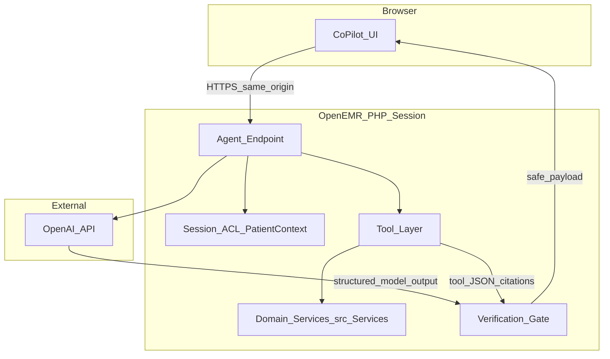

# AgentForge Clinical Co-Pilot — Technical architecture

**Upstream:** [openemr/openemr](https://github.com/openemr/openemr/tree/master)  
**License context:** OpenEMR is GPL-3.0-or-later; this fork’s additive documentation does not change upstream licensing.

---

## One-page summary (~500 words)

OpenEMR is a mature monolithic electronic health record with multiple architectural eras: a growing PSR-4 `OpenEMR\` tree under `src/`, legacy procedural code under `library/` and `interface/`, a PSR-11 bootstrap (`bootstrap.php`) used by the modern front controller (`public/index.php`), and Laminas MVC modules for selected subsystems. The Clinical Co-Pilot is designed to **sit inside that reality** rather than replace it: the agent’s **trust boundary** is the **same authenticated PHP request** as the rest of the clinician UI, using **in-process** calls into OpenEMR’s **authorization and data-access patterns**, not a parallel “super-user” FHIR client for this sprint.

The user is a **high-volume primary care physician** (see [USERS.md](USERS.md)). The highest-value window is **between exam rooms**, when the physician must reconstruct context in under a minute. That imposes **strict latency goals** and a **speed-versus-completeness** tradeoff: the system should return a **thin, verifiable briefing** quickly, support **follow-up questions**, and **label uncertainty** when the chart is incomplete.

**Large language model:** The sprint uses the **OpenAI HTTP API** against **synthetic demo chart content only** (per program instructions). Production-grade deployment would require **Business Associate Agreements**, **minimum necessary** payloads, **subprocessor governance**, and **verified** data retention and training exclusions—documented as a forward path, not assumed solved by the class environment.

**Tooling strategy:** Tools are **PHP functions or thin controller handlers** that gather **structured patient data** by reusing existing OpenEMR services (for example `OpenEMR\Services\PatientService` and other domain services under `src/Services/`) **only after** the request is operating under a **valid staff session** and **active patient context**, with the same **access checks** the UI would rely on. Tools return **JSON** suitable for model consumption (field-limited, no full chart dumps by default).

**Verification:** The model emits a **structured response schema** pairing **factual clinical statements** with **citation handles** referencing tool output (record IDs, table row references, or opaque server-side keys that resolve only server-side). A **PHP verification gate** strips or downgrades any **uncited factual claim** before the UI renders it. **Domain constraints** (e.g. hard limits on dosing suggestions, or prohibition on definitive new diagnoses) are enforced in **PHP rules**, not delegated to the model.

**Observability:** The architecture compares **four** patterns: (1) **Langfuse** or similar SaaS with **strict redaction** and no raw PHI; (2) **self-hosted** trace store inside the clinic VPC; (3) a **dedicated database table** storing redacted step metadata; (4) **application JSON logs** only. For the sprint, the **default recommendation** is **(4) plus optional (3)** for demo-friendly audit trails, moving to **(2)** before any real PHI.

**Failure modes:** Tool timeouts, partial records, and model **malformation** must yield **degraded but honest** responses—never silent wrong facts. The UI shows **which tools ran**, what **failed**, and what **could not be verified**.

**Evolution:** If the product graduates beyond synthetic demos, the documented **production** path is **OAuth2-scoped FHIR or Standard API** tools with explicit client scoping—without changing the core principle that **authorization is never delegated to the LLM**.

Agent tools execute in-process under the authenticated OpenEMR session, delegating to the same authorization and data-access layers as the clinical UI; we are not exposing a separate broad FHIR client for this sprint, because of this project’s scope, and we document the production path to OAuth2-scoped tools if the agent were promoted beyond synthetic data.

---

## Table of contents

1. [Repository scope (Week 1 / PRD)](#repository-scope-week-1--prd)  
2. [Goals and non-goals](#goals-and-non-goals)  
3. [Alignment with USERS.md](#alignment-with-usersmd)  
4. [High-level system diagram](#high-level-system-diagram)  
5. [Trust boundaries](#trust-boundaries)  
6. [Request path and OpenEMR integration](#request-path-and-openemr-integration)  
7. [Tool layer](#tool-layer)  
8. [LLM integration (OpenAI)](#llm-integration-openai)  
9. [Verification pipeline](#verification-pipeline)  
10. [Observability options](#observability-options)  
11. [Evaluation hooks](#evaluation-hooks) ([dataset](#eval-dataset-canonical-description) · [run](#how-to-run-the-eval-suite) · [results](#results-submission-log))  
12. [AI cost analysis (planning)](#ai-cost-analysis-planning) ([measured spend](#measured-development-spend) · [projection assumptions](#projection-assumptions))  
13. [Failure modes and degradation](#failure-modes-and-degradation)  
14. [Deployment (TBD checklist)](#deployment-tbd-checklist) ([Stage 1 local](#canonical-local-environment-stage-1) · [Stage 2 hosting](#target-hosting-stage-2-public-deploy))  
15. [References within this repository](#references-within-this-repository)

---

## Repository scope (Week 1 / PRD)

**Single source of truth in this fork:** Week 1 AgentForge planning, hard-gate documentation, deployment URL for submissions, and summaries of eval intent and AI cost **live in this repository**—primarily in [AUDIT.md](AUDIT.md), [USERS.md](USERS.md), and this file—alongside [`PRD_Week1_AgentForge.md`](PRD_Week1_AgentForge.md). Avoid parallel specs in external tools that can drift from what graders see in GitHub.

**Capability boundary:** [USERS.md](USERS.md) defines the **only** user problems the agent may address; every tool, prompt, and UI behavior in later implementation must **trace to a use case** there. The audit ([AUDIT.md](AUDIT.md)) is the **input** to this architecture plan (PRD Stage 5); implementation should not outrun audited risks.

**PRD checkpoint → document map**

| PRD stage / gate | Where it is satisfied in-repo |
|------------------|-------------------------------|
| Stage 1 — Run locally | [Canonical local environment (Stage 1)](#canonical-local-environment-stage-1) in this file; detailed commands in [CONTRIBUTING.md](CONTRIBUTING.md) / [CLAUDE.md](CLAUDE.md) |
| Stage 2 — Deploy | [Target hosting (Stage 2 public deploy)](#target-hosting-stage-2-public-deploy); canonical URL in [Deployment (TBD checklist)](#deployment-tbd-checklist) |
| Stage 3 — Audit | [AUDIT.md](AUDIT.md) (five audit areas + ~500 word summary) |
| Stage 4 — Users & use cases | [USERS.md](USERS.md) (narrow user + use cases + why conversational) |
| Stage 5 — Agent integration plan | This file (~500 word summary + technical sections) |
| Observability minimum questions | [Observability options](#observability-options) |
| Evaluation / test suite | [Evaluation hooks](#evaluation-hooks) (dataset, run instructions, [results log](#results-submission-log)); test code and fixtures under `tests/` when they exist |
| Submitted deployed URL | [Deployment (TBD checklist)](#deployment-tbd-checklist) — canonical URL field |

**Course deliverables vs. these three files:** The PRD also names a fork **README** (setup guide), an **eval dataset with results**, and **AI cost analysis**. **Eval dataset description, how to run the suite, submission results, and measured plus projected AI cost are canonical in this file** ([Evaluation hooks](#evaluation-hooks) and [AI cost analysis (planning)](#ai-cost-analysis-planning)). Keep the fork **README** short and point here for grading. If instructors require **additional** separate committed artifacts, add them outside this file and link one line from here.

---

## Goals and non-goals

**Goals**

- **Sub-minute** orientation for the PCP use cases in [USERS.md](USERS.md).
- **Citation-backed** clinical statements for chart-derived facts.
- **Server-side-only** orchestration (no PHI-bearing tool calls from untrusted browser code).
- **Additive** implementation: prefer new module routes and services over forking core legacy files.

**Non-goals (sprint)**

- Autonomous clinical decision-making or autonomous ordering.
- Full FHIR tool chain **inside** the sprint (see summary sentence above).
- Training or fine-tuning a model on customer data.

---

## Alignment with USERS.md

| US case | Architectural components |
|---------|----------------------------|
| UC1 Visit framing | Encounters + problems tools; summarization prompt; verification |
| UC2 Deltas | Labs/meds tools with “since last visit” windowing; uncertainty labels |
| UC3 Pre-room checks | Rule engine + cited suggestions; explicit “verify with patient” copy |

---

## High-level system diagram

---

## Trust boundaries

| Boundary | Responsibility |
|----------|------------------|
| Browser ↔ OpenEMR | Standard OpenEMR session cookies / CSRF patterns for new endpoints. |
| OpenEMR ↔ OpenAI | **Minimum necessary** JSON; TLS; API key in server config only; **no PHI in client-accessible logs**. |
| Model ↔ User | **No** unverified factual text; verification gate is mandatory. |

---

## Request path and OpenEMR integration

Modern requests may enter through [`public/index.php`](public/index.php), which loads the PSR-11 container from [`bootstrap.php`](bootstrap.php) and delegates routing via `OpenEMR\BC\FallbackRouter` to legacy scripts. Agent endpoints should follow **the same authentication bootstrap** as other privileged PHP entrypoints (exact file(s) depend on implementation choice: new route under `interface/` or custom module pattern).

**Principle:** The agent never receives a **wider** data scope than the logged-in user for the **currently selected patient**.

---

## Tool layer

**Design**

- Each tool: **name**, **input schema** (patient id, date windows, optional question), **output JSON**, **max runtime**, **idempotent** where possible.
- Tools call **`OpenEMR\Services\*`** or other approved internal APIs—not raw SQL from the model.

**Initial tool candidates (illustrative)**

| Tool | Purpose | Typical service anchor |
|------|---------|-------------------------|
| `patient_core` | Demographics, PCCP, identifiers | `OpenEMR\Services\PatientService` |
| `active_meds` | Medication list snapshot | Domain medication services |
| `recent_labs` | Windowed labs | Lab result services |
| `recent_encounters` | Visit list / reasons | Encounter-related services |

*(Exact method names should be pinned when code is written; PatientService is the canonical patient row access pattern in `src/Services/PatientService.php`.)*

---

## LLM integration (OpenAI)

- **Transport:** HTTPS to OpenAI’s API from PHP (e.g. Guzzle — already a project dependency per `composer.json`).
- **Configuration:** API key from environment or secured config **outside** webroot; never embedded in frontend.
- **Prompting:** System prompt encodes **citation requirements**, **refusal rules**, and **scope** (active patient only).
- **BAA / enterprise:** Document in [AUDIT.md](AUDIT.md) compliance section; use **Azure OpenAI** or **OpenAI Enterprise** if a real hospital required a single named BAA—sprint may use developer API **only with synthetic data**.

---

## Verification pipeline

1. **Plan:** Model may emit a hidden chain-of-thought **only if** your vendor/policy allows; otherwise use **structured tool plans** without chain-of-thought storage.
2. **Tool execution:** Server runs tools; results stored **in memory** for the request (or short-lived server-side cache keyed by session).
3. **Model answer:** Must conform to JSON schema: `{ "statements": [ { "text", "citations": ["..."] } ], "uncertainties": [...] }`.
4. **PHP gate:** Drop statements whose citations do not resolve to tool JSON; convert borderline cases to **uncertainty** strings.
5. **Rule engine:** Secondary pass for **forbidden content** (e.g. definitive new cancer diagnosis strings) regardless of citations.

---

## Observability options

| Option | Pros | Cons | PHI risk |
|--------|------|------|----------|
| **A. Langfuse (cloud)** | Rich traces, token/cost dashboards | Third-party subprocessors | **High** if raw prompts logged |
| **B. Self-hosted trace DB** | Control, VPC-only | Ops burden | **Medium**—must redact |
| **C. OpenEMR DB audit table** | Stays in app boundary | Schema + migration work | **Low** if redacted columns only |
| **D. PHP JSON logs** | Fastest sprint path | Weaker UI | **Low** with redaction |

**Sprint recommendation:** **D**, optionally **C** for structured step timing; migrate toward **B** before production PHI.

**Minimum questions observability must answer (PRD):**

- What did the agent do, **in order**?
- How long did each step take?
- Which tools failed and why?
- Token usage and **estimated cost** per request?

**PRD bar (“real, wired in, used”):** Observability is not satisfied by installing a library alone. The chosen approach must emit structured events or logs on **actual** agent requests, be **consulted** when debugging (e.g. step timing, tool errors), and inform cost/token discipline—not a dormant dependency.

---

## Evaluation hooks

**Intent (PRD):** The suite must be **defensible**—not only happy paths. It should surface failure modes that matter in clinical settings: missing chart fields, ambiguous user phrasing, tool timeouts, malformed model JSON, and **unauthorized** data access attempts.

| Category | What “pass” means (examples) |
|----------|----------------------------|
| **Schema / verification** | Output JSON validates; uncited factual statements are stripped or downgraded. |
| **Tool + gate integration** | Given golden tool JSON fixtures, rendered user text matches expected safe payload. |
| **Authorization** | User/session A cannot obtain patient B’s tool payloads (negative tests). |
| **Resilience** | Simulated OpenAI errors or empty tool results yield explicit degradation, not silent invention. |

**Mechanisms:** Unit tests for JSON schema and verification gate; integration tests with **mocked** OpenAI; synthetic fixtures only (**no real PHI**).

### Eval dataset (canonical description)

This subsection is the **single in-repo description** of what the eval suite is intended to cover (PRD: defensible, not only happy paths). Implementation lives under `tests/` when added; scenarios below map to the category table above.

| Scenario group | Intent | Status |
|----------------|--------|--------|
| **Missing / incomplete chart** | Tool or model sees empty sections; output labels gaps, does not invent facts | TBD — wire tests when agent + tools exist |
| **Authorization / wrong patient** | Session A cannot retrieve patient B tool payloads; IDOR attempts fail closed | TBD |
| **Malformed model JSON** | Parser + one repair path; safe degradation | TBD |
| **Tool timeout / OpenAI error** | Explicit user-visible degradation; no silent invention | TBD |
| **Ambiguous user phrasing** | Clarification or conservative answer with uncertainty | TBD |
| **Golden tool JSON → safe UI text** | Given fixture tool output + model output, rendered text matches expected verified payload | Partial — `VerificationGateIsolatedTest` covers citation path resolution and stripping |

All cases use **synthetic** chart and user strings only (**no real PHI**).

### How to run the eval suite

- **Isolated (host, no DB):** `composer dump-autoload -o` then `composer phpunit-isolated -- --filter ClinicalCopilot` (or `vendor/bin/phpunit -c phpunit-isolated.xml --filter ClinicalCopilot`) — see [README-Isolated-Testing.md](README-Isolated-Testing.md). Covers citation verification for the Clinical Co-Pilot module (`tests/Tests/Isolated/ClinicalCopilot/`).
- **Full stack inside Docker:** From `docker/development-easy/`, use `/root/devtools` targets (e.g. `unit-test`, `services-test`) per [CLAUDE.md](CLAUDE.md) when tests require OpenEMR bootstrap, DB, or integration surfaces.

Update this subsection when a dedicated agent/phpunit suite name exists (e.g. custom `phpunit.xml` group).

### Results (submission log)

Record every meaningful eval run you want graders to credit. Link to CI job URLs if results live primarily in GitHub Actions.

| Date | Command | Pass / Fail | Notes |
|------|---------|---------------|-------|
| 2026-04-29 | `composer phpunit-isolated -- --filter ClinicalCopilot` | *(run locally / CI)* | Verifies `VerificationGate` citation stripping for `oe-module-clinical-copilot` |

---

## AI cost analysis (planning)

This section is the **canonical in-repo** place for **measured development spend**, **projection assumptions**, and **scale implications** (PRD submission: AI cost analysis). Update numbers after integration work; keep sources noted for auditability.

### Measured development spend

| Field | Value |
|-------|--------|
| **Date range** | — *(fill after first billing period)* |
| **Model(s)** | — *(e.g. gpt-4.x / reasoning tier)* |
| **Rough USD total** | — *(from vendor billing export or dashboard)* |
| **Data source** | — *(e.g. OpenAI usage page, export file name)* |
| **Notes** | Track average tools per request and tokens in/out when the agent loop is instrumented. |

### Projection assumptions

These variables feed order-of-magnitude cost thinking; **replace defaults with measured averages** from logs or observability once the agent is wired.

| Symbol | Meaning | Initial placeholder (revise with data) |
|--------|---------|----------------------------------------|
| *N* | Concurrent clinicians (or active sessions) | TBD |
| *R* | Agent requests per clinician per hour | TBD |
| *T* | Total input + output **tokens** per request (include tool JSON and verification passes) | TBD; tool-heavy flows grow *T* faster than chat-only |

Cost scales roughly with *N × R × T ×* price-per-token; **bounded tools**, **verification passes**, and **caching policy** dominate at scale—this is **not** “cost-per-token × users” alone.

### Illustrative scale table (architectural implications, not measured billing)

The following table is **not** a bill forecast; it records **engineering responses** at different adoption levels given the assumptions above.

| Scale (active clinical users) | Architectural implication |
|------------------------------|----------------------------|
| **~100** | Single-region OpenEMR + rate limits; shared API key pool with per-tenant budgets if multi-site. |
| **~1K** | Queue or throttle agent requests; cache **non-PHI** or redacted short-lived briefings where policy allows; consider reserved throughput / enterprise API. |
| **~10K** | Regional deployment, aggressive **minimum-necessary** prompts, model tiering (smaller model for routing), batch where safe—not linear “token × users” without redesign. |
| **~100K** | Dedicated inference contracts, possible **on-VPC** or Azure OpenAI–class deployments; observability and cost allocation per site/department. |

---

## Failure modes and degradation

| Failure | User-visible behavior |
|---------|-------------------------|
| Tool timeout | “Labs unavailable—showing problems only.” |
| Empty chart section | Explicit **missing data** label. |
| Model JSON invalid | One automatic **repair** attempt; else safe error. |
| OpenAI outage | Cached last-good briefing **if policy allows**; else clear outage message. |

---

## Deployment (TBD checklist)

**Canonical deployed application URL (PRD submissions):**  
`https://openemr-210925-0.cloudclusters.net/` — Cloud Clusters managed OpenEMR (Week 1 AgentForge); keep in sync with course submission forms.

### Target hosting (Stage 2 public deploy)

**Provider:** **[Cloud Clusters](https://www.cloudclusters.io/cloud/openemr)** — **OpenEMR Docker** managed hosting (not Railway). Rationale: many current OpenEMR users and practices already run on or are familiar with this class of **managed, Docker-based** OpenEMR hosting, which supports trust and operational expectations for demos and SMB-style deployments.

**Vendor positioning (marketing summary):** OpenEMR is described as a widely used open-source EHR and practice-management stack; Cloud Clusters advertises **easy deployments**, simplified management, **high network security**, reliability, and uptime, with entry pricing around **$4.99/mo** and a **free demo** path. Plan highlights from their OpenEMR product page: **SMB-friendly**, **managed cloud**, **OpenEMR 7.0.1 Community**, stack **Ubuntu + MySQL 8.0 + PHP 7.4 + Apache 2.4** (confirm the **live** image/version and PHP runtime in your control panel after provisioning—vendor pages can lag upstream `master`, and local Easy Docker often uses **newer PHP**; validate agent and OpenEMR compatibility on the **actual** hosted stack).

**Topology:**

- **Compute:** Managed OpenEMR **Docker** instance on Cloud Clusters’ platform (isolated resources per tenant per their documentation).
- **Data / DB:** **MySQL 8.0** per vendor environment description; backups and on-demand restore advertised as control-panel features.
- **Networking/TLS:** Public HTTPS URL with **free SSL** per vendor; keep OpenEMR cookies and admin URLs on HTTPS-only paths.
- **Configuration:** Admin password, DNS, SSL, and any **OpenAI API keys** for the agent via the **Cloud Clusters control panel** (and OpenEMR globals)—**never** commit secrets to the repository.
- **Scope:** Single-environment Week 1 baseline (no multi-region / HA claim unless you extend it).

**Alignment with local:** Stage 1 remains **Easy Development Docker** under [`docker/development-easy/`](docker/development-easy/). Stage 2 is **Cloud Clusters** managed OpenEMR, so behavior is “same product family, possibly different PHP/compose details”—**re-test** the agent and co-pilot paths on the hosted URL after deploy. See [DOCKER_README.md](DOCKER_README.md) for local Docker layout.

**Runtime (pin when live):** Record the **actual** PHP and OpenEMR versions shown in Cloud Clusters after install; compare to [CLAUDE.md](CLAUDE.md) / [CONTRIBUTING.md](CONTRIBUTING.md) local flex image if you hit extension or version skew.

Before going live even with synthetic data, complete:

- [ ] Confirm Cloud Clusters HTTPS endpoint, cookie security flags, and HTTPS-only access  
- [ ] Secrets and API keys only in control panel / OpenEMR secured globals—never in git  
- [ ] Admin password rotation / demo banner  
- [ ] Platform and app log **redaction** rules (including prompt/tool payload controls); review host **WAF** / platform logging if enabled  
- [ ] Backup/restore policy using Cloud Clusters backup features + OpenEMR export posture  
- [ ] Rollback/redeploy path (snapshot, plan downgrade, or redeploy from vendor workflow)  

### Canonical local environment (Stage 1)

**Canonical path** for “run OpenEMR locally” in this fork is the **Easy Development Docker** stack under [`docker/development-easy/`](docker/development-easy/), started per [CONTRIBUTING.md — Code contributions (local development)](CONTRIBUTING.md#code-contributions-local-development) and summarized in [CLAUDE.md](CLAUDE.md): after `docker compose up --detach --wait` from that directory, the app is at **http://localhost:8300/** or **https://localhost:9300/**; default login **admin** / **pass**; phpMyAdmin at **http://localhost:8310/** when that service is part of the compose profile. Load **realistic sample patient data** for demos (PRD Stage 1)—**synthetic / demo only; never production PHI**.

**Pointers (commands and CI expectations live in these files—avoid duplicating long runbooks here):**

- [CONTRIBUTING.md](CONTRIBUTING.md) — local development and contribution workflow  
- [DOCKER_README.md](DOCKER_README.md) — production vs development Docker families  
- [CLAUDE.md](CLAUDE.md) — URLs, credentials summary, and `docker compose exec openemr /root/devtools` test entrypoints  
- [README-Isolated-Testing.md](README-Isolated-Testing.md) — host-only PHPUnit (`composer phpunit-isolated`) for isolated suites when logging eval runs without a full DB  
- Upstream reference: [openemr/openemr](https://github.com/openemr/openemr) for stack changes outside this fork  

**Fork-specific compose/env overrides (fill as you stabilize):**

- *(None documented yet—add bullets here for env vars or compose file paths unique to this fork.)*

---

## References within this repository

| Topic | Location |
|--------|----------|
| Front controller + DI bootstrap | [`public/index.php`](public/index.php), [`bootstrap.php`](bootstrap.php) |
| Legacy routing bridge | [`src/BC/FallbackRouter.php`](src/BC/FallbackRouter.php) |
| Modern services | [`src/Services/`](src/Services/) (e.g. [`src/Services/PatientService.php`](src/Services/PatientService.php)) |
| API / OAuth / FHIR (future path) | [`Documentation/api/`](Documentation/api/) |
| Contributor / quality bar | [`CLAUDE.md`](CLAUDE.md) |
| Security reporting | [`.github/SECURITY.md`](.github/SECURITY.md) |
| PRD | [`PRD_Week1_AgentForge.md`](PRD_Week1_AgentForge.md) |

---

## Document control

| Field | Value |
|--------|--------|
| **Project** | AgentForge — Clinical Co-Pilot |
| **Companion documents** | [USERS.md](USERS.md), [AUDIT.md](AUDIT.md) |
| **PRD (Week 1)** | [`PRD_Week1_AgentForge.md`](PRD_Week1_AgentForge.md) — submission table lists `./USER.md`; this fork uses **`./USERS.md`** at repo root (align with graders if needed). |
