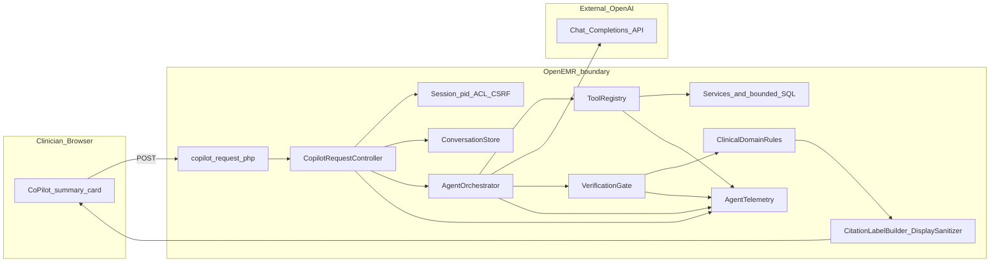

# AgentForge Clinical Co-Pilot — ARCHITECTURE

**Upstream:** [openemr/openemr](https://github.com/openemr/openemr/tree/master)  
**License:** OpenEMR is GPL-3.0-or-later; this module is additive work in that context.  
**Implementation:** `interface/modules/custom_modules/oe-module-clinical-copilot/`  
**Namespace:** `OpenEMR\Modules\ClinicalCopilot`

**PRD anchor:** [`.cursor/rules/agentforge-clinical-copilot-requirements.mdc`](.cursor/rules/agentforge-clinical-copilot-requirements.mdc). Local setup, Docker, and contribution flow stay in [CONTRIBUTING.md](CONTRIBUTING.md) and the root READMEs—point there instead of duplicating them.

---

## Summary (current repo state)

The co-pilot lives **inside** OpenEMR’s session: same authenticated user, same active `pid`, same-origin POST from the patient summary card to `public/copilot_request.php`, handled by `CopilotRequestController`, orchestrated by `AgentOrchestrator`. The model never gets a wandering API key to the database; it sees **bounded JSON** from three registered tools (`get_chart_lists`, `get_recent_encounters`, `get_recent_labs`). Responses are structured JSON with dot-path citations; `VerificationGate` drops anything that doesn’t resolve against the merged tool bundle; `ClinicalDomainRules` removes dosing/imperative tone and “new diagnosis” swagger even when a citation exists; `CitationLabelBuilder` + `DisplaySanitizer` shape what the card renders. `AgentTelemetry` logs ordered steps, timings, tool names, token totals, and rough USD—server-side, redaction-aware.

**Five priorities:** bounded access, verifiable output, visible failure modes, telemetry from day one, additive UI—no fork of the whole chart.

**Where I was wrong once:** an early shape pushed “give the model the whole merged bundle in one shot every time.” Reviewing outputs was miserable—too much text, too many places a confident sentence could hide. Splitting **three tools** with stable merge roots (`chart_lists`, `recent_encounters`, `recent_labs`) plus a **verification pass after** the model answers made the safety story explainable in a code review, not just in a prompt.

**Contrarian line I’ll defend:** calling the card a “co-pilot” oversells the between-rooms moment. In ~90 seconds the user mostly wants **one good brief**; multi-turn is for the second question after they’ve looked at something concrete. The UI reflects that: one fat primary action, transcript first, sources under the last reply ([`summary_card.html.twig`](interface/modules/custom_modules/oe-module-clinical-copilot/templates/clinical_copilot/summary_card.html.twig)).

**Gap vs team targets (honest):** [USERS.md](USERS.md) lists **7** use cases; **3** are implemented today, **4** are forward. **3** LLM-callable tools ship; **5** is the target (**2** named forward below). Isolated PHPUnit under `tests/Tests/Isolated/ClinicalCopilot/` has **21** test methods today; **30+** is the floor we’re driving toward—see [Evaluation strategy](#evaluation-strategy-and-eval-matrix).

---

## Table of contents

1. [Executive position](#executive-architecture-position)  
2. [Users, workflow, scope](#users-workflow-and-scope)  
3. [Design principles](#design-principles)  
4. [Architecture diagram](#one-slide-architecture-visual)  
5. [System components](#system-components)  
6. [Request path, runtime flow, 90s UX](#request-path-runtime-flow-and-90-second-ux)  
7. [Trust boundaries and authorization](#trust-boundaries-and-authorization)  
8. [Tool layer (3 + 2 forward)](#tool-layer)  
9. [LLM integration](#llm-integration)  
10. [Verification system](#verification-system)  
11. [Observability](#observability)  
12. [Failure modes](#failure-modes-and-graceful-degradation)  
13. [Evaluation strategy and eval matrix](#evaluation-strategy-and-eval-matrix)  
14. [Deployment](#deployment-architecture)  
15. [Scale and cost (architecture view)](#scale-cost-and-production-path)  
16. [Known limitations](#known-limitations-and-tradeoffs)  
17. [Notes for reviewers](#notes-for-reviewers)  
18. [Forward path to PRD scale](#forward-path-to-prd-scale)  
19. [Repository references](#repository-references)  
20. [Document control](#document-control)

---

## Executive architecture position

1. Keep the agent inside OpenEMR’s session and ACL model.  
2. Constrain the model to server-approved tools and bounded payloads.  
3. Verify before the UI shows factual lines.  
4. Fail loud: malformed JSON, OpenAI errors, empty tools—structured errors back to the card.  
5. Instrument the path so we can answer “what ran, in what order, for how long, at what cost.”

The model is an **untrusted reasoner**; PHP remains the authority for authz, tool execution, verification, and display.

---

## Users, workflow, and scope

See [USERS.md](USERS.md). Implemented use cases: **UC1** visit framing, **UC2** deltas, **UC3** pre-room checks. **UC4–UC7** are documented there as forward work (care gaps, med reconciliation, high-risk composite, inbox triage).

This module does **not** place orders, write the chart, or answer off-patient medical chat.

---

## Design principles

1. **Inherit trust** — agent trust ≤ session trust.  
2. **Minimum necessary** — send the model what the question needs, capped.  
3. **Verify then render** — no citation path → no factual line.  
4. **Fail by omission** — missing data surfaces as uncertainty or error, not fabrication.  
5. **Additive integration** — custom module under `interface/modules/custom_modules/…`, not a rewrite of core chart code.  
6. **Observable** — if we can’t reconstruct a request from logs, we didn’t finish the job.  
7. **Label forward work** — production paths described in AUDIT/ARCHITECTURE are marked when they’re not shipped yet.

---

## One-slide architecture visual

---

## System components

| Component | Location | Role |
|-----------|----------|------|
| Module bootstrap | `…/openemr.bootstrap.php` | Registers namespace / hooks when module enabled |
| Patient UI | `src/ClinicalCopilotCard.php`, `templates/clinical_copilot/summary_card.html.twig` | Card on patient dashboard |
| HTTP entry | `public/copilot_request.php` | Loads OpenEMR env, dispatches controller |
| Controller | `src/Controller/CopilotRequestController.php` | CSRF, ACL, `pid`, conversation, orchestration, JSON response |
| Conversation | `ConversationStore` | Multi-turn text in session (no raw chart JSON in session per module README intent) |
| Tools | `ToolRegistry` + `src/Services/Tools/*` | Three tools today; OpenAI `tools[]` definitions |
| Orchestrator | `AgentOrchestrator` | Tool loop (max 5 rounds), fallback pre-merged bundle, verify + domain + UI payload |
| Verification | `VerificationGate` | Citation path resolution against merged tool JSON |
| Domain guard | `ClinicalDomainRules` | Post-verify clinical language filter |
| Presentation | `CitationLabelBuilder`, `DisplaySanitizer` | Safe labels and text for the card |
| Telemetry | `AgentTelemetry` | Structured JSON logs |

---

## Request path, runtime flow, and 90-second UX

**Runtime (happy path):** Open patient → card visible → **Generate Patient Brief** → POST `action=brief` with CSRF → controller reads session `pid` → `ToolRegistry::collectMerged($pid)` → `AgentOrchestrator` calls OpenAI with `tools[]` → model may request tools; server runs `runTool(name, pid)` → model returns JSON `{ statements, uncertainties }` → `VerificationGate` → `ClinicalDomainRules` → statements + labels to UI → telemetry flush.

**90-second UX (what actually matters):** (1) One obvious primary control—the brief button is styled as the main action in `summary_card.html.twig`. (2) Critical path is **click → merge tools → first model round**; LLM latency dominates, so we don’t add extra client round-trips. (3) **Transcript above sources**—the answer is the brief; citations are audit trail, not the headline. (4) `aria-live="polite"` on the transcript for screen-reader users catching updates without stealing focus.

**Forward UX (not built):** token streaming; prefetch merged tool JSON on chart open; inline “low confidence” when uncertainties dominate; keyboard shortcut to trigger brief from flowsheet contexts.

---

## Trust boundaries and authorization

| Boundary | Allowed | Not allowed |
|----------|---------|-------------|
| Browser ↔ OpenEMR | Same-origin POST, CSRF, session cookie model | Client-side tool execution or client-chosen `pid` for chart read |
| OpenEMR ↔ Model | Bounded JSON excerpts over HTTPS from PHP | Model-driven SQL, arbitrary patient fetch |
| Model ↔ Clinician | Verified, domain-filtered, sanitized lines | Raw model text straight to DOM |

**Today’s ACL notes:** Co-pilot controller requires `patients` / `demo`. `RecentLabsTool` additionally requires `patients` / `lab` or it returns `insufficient_acl` in the payload.

---

## Tool layer

Each tool exposes `openAiToolDefinition()` (function schema), `execute(int $pid)`, and a stable **merge root** key for citations. **Patient id is never a tool argument**—scope comes from the session inside `runTool`.

### Implemented (in `ToolRegistry`)

| Tool name | Merge root | Role |
|-----------|--------------|------|
| `get_chart_lists` | `chart_lists` | Allergies, meds, problems + chart context via `ChartContextTool` |
| `get_recent_encounters` | `recent_encounters` | Last N encounters, dates, categories, reasons (often empty—see USERS.md) |
| `get_recent_labs` | `recent_labs` | Bounded `procedure_result` / `procedure_report` / `procedure_order` join |

Schemas use **empty object parameters** (`properties: {}`, `additionalProperties: false`) because the server owns `pid`—new tools should keep that contract unless there’s a strong, reviewed reason to add arguments.

### Forward (not registered yet — toward “5 true LLM tools”)

| Tool name (proposed) | Purpose | Notes |
|----------------------|---------|--------|
| `get_pending_results` | Orders / reports not fully attached or unsigned—bounded rows for “what’s still open” | Reuse lab ACL patterns; new merge root e.g. `pending_results.*` |
| `get_active_orders` | Active medication / lab orders slice for UC2/UC5 | Bounded by `pid` + status; must not become a full order-history firehose |

Orchestration today: OpenAI tool-calling loop with cap, plus **fallback** that sends `TOOL_BUNDLE_JSON` + `response_format: json_object` when the loop yields no parseable assistant content (`AgentOrchestrator`).

---

## LLM integration

- **Transport:** Server-side HTTPS (`OpenAiClient`).  
- **Secrets:** Globals / env (`clinical_copilot_openai_model`, API key via env or globals per module README)—never in frontend.  
- **Output contract:** JSON only; citation paths under `chart_lists.*`, `recent_encounters.*`, `recent_labs.*` (see system prompt in `AgentOrchestrator::buildSystemPrompt()`).

Synthetic demo data only for class; real PHI needs the compliance stack spelled out in [AUDIT.md](AUDIT.md).

---

## Verification system

**Goal:** If the UI shows a factual line, every citation path must resolve to **non-empty** values in the merged tool output (`VerificationGate`).

**Concrete `ClinicalDomainRules` behaviors (today’s code):**

- **Dosing / imperative:** Lines matching patterns like “take … mg”, “give … units”, `\d+\s*(mg|mcg)\s*(daily|twice|…)”, or phrases like “start the patient on” / “increase the dose” are **dropped** regardless of whether a citation existed—citations prove *chart text*, not that dosing advice is safe to echo.  
- **“New diagnosis” tone:** Regex on phrases like “you have”, “patient has”, “new diagnosis of” → **dropped**.  
- **Polypharmacy (≥12 meds from `chart_lists.medications`):** If the line uses medication *action* language (`start`, `bid`, `titrate`, `\d+\s*mg`, etc.) and **no** citation path contains `medications`, the line is **dropped**; an **uncertainty** line is appended telling the clinician to verify meds in the room.

Verification proves **alignment to tool JSON**, not clinical correctness—that’s still the clinician’s job.

---

## Observability

`AgentTelemetry` records request id, ordered marks (tools, OpenAI rounds, verification counts, errors), timing hints, redacted detail strings, token usage, model id, estimated USD. **Detailed traces stay server-side**; the card can show aggregate usage in a `
` block.

**Langfuse (optional):** When **Admin → Config → Portal → Clinical Co-Pilot: allow Langfuse observability export** is on and Langfuse API keys are set in the environment, the module **dual-writes** the same request lifecycle to Langfuse via batch ingestion (`LangfuseCopilotObservability`): one trace per AJAX `request_id`, spans for tool collect / tools / verification / domain rules, and **generation** rows per OpenAI round with model + token usage + latency. **Default export is metadata-only** (no prompts or tool JSON). **`LANGFUSE_CLINICAL_COPILOT_IO=redacted`** enables truncated previews for non-PHI environments only. Fail-open: export errors never change the JSON response to the card. Operator matrix: [module README](interface/modules/custom_modules/oe-module-clinical-copilot/README.md).

DB-backed OpenEMR audit tables for co-pilot reads remain forward work tied to [AUDIT.md](AUDIT.md) F2.

---

## Failure modes and graceful degradation

| Failure | Behavior |
|---------|----------|
| No `pid` | `no_active_patient` |
| Missing API key | `missing_openai_api_key` |
| Tool empty / ACL | Tool JSON includes `note` / empty arrays; model instructed to use uncertainties |
| Tool loop empty / API error | Fallback pre-merged OpenAI path; `fallback_premerged` flag in response |
| Malformed model JSON | `malformed_model_json` to client |
| Uncited statements | Stripped; counts in telemetry |

Not implemented: automatic JSON repair retries, server-side briefing cache, complex partial-timeout merge across tools.

---

## Evaluation strategy and eval matrix

**Today:** **21** PHPUnit test methods across **6** files under `tests/Tests/Isolated/ClinicalCopilot/`:

| File | Tests (today) |
|------|----------------|
| `VerificationGateIsolatedTest.php` | 7 |
| `ClinicalDomainRulesTest.php` | 3 |
| `ToolRegistryIsolatedTest.php` | 2 |
| `CitationLabelBuilderTest.php` | 1 |
| `OpenAiClientMergeUsageIsolatedTest.php` | 1 |
| `CopilotObservabilityIsolatedTest.php` | 7 |

Run: `composer phpunit-isolated -- --filter ClinicalCopilot` (see [CONTRIBUTING.md](CONTRIBUTING.md) / isolated testing README for host setup).

**Team bar:** **30+** evals with edge cases and failure paths. Planned expansion (names are targets for new tests—not all exist yet):

| Area | Today → Target | Examples to add |
|------|----------------|-----------------|
| Verification | 7 → 12 | Deep nested paths; type mismatch at leaf; empty string vs missing; multi-citation partial fail; list-of-lists |
| Domain rules | 3 → 8 | Pregnancy cue + med action; contraindication phrasing; definitive prognosis; edge polypharmacy count boundary |
| Tool registry | 2 → 6 | Unknown tool; exception path; ACL note propagation; JSON encode failure; deterministic tool order |
| Citation labels | 1 → 4 | Missing path segment; long label truncation; multiple list indices |
| OpenAI client / usage | 1 → 5 | Partial `usage` object; missing usage keys; malformed upstream JSON; fallback path accounting |
| Controller / conversation | 0 → 5 | Invalid `action`; trim chat boundary; malformed prior chat row; conversation token mismatch (integration harness) |

**Target total:** **~40** methods with **30+** as the minimum shipped floor for “final” gate. Negative ACL / DB-backed tests belong in an integration harness ([AUDIT.md](AUDIT.md) **F2**/**F3**)—called out explicitly so isolated counts don’t fake coverage. Redaction and log discipline track **F1**; verification + uncertainties track **F4**; perf/cap work tracks **F5**.

---

## Deployment architecture

- **Local:** `docker/development-easy/` per repo docs—`http://localhost:8300/` (see CONTRIBUTING / Docker README).  
- **Public demo (Week 1):** `https://openemr-210925-0.cloudclusters.net/` — sprint host, not a production hardening claim.

Before PHI: TLS review, secret handling, log redaction, backup policy, model vendor contract, rate limits.

---

## Scale, cost, and production path

Cost drivers: requests per clinician per day, merged JSON size, tool rounds, conversation length, verification retries. At scale you tighten payloads, add throttles, separate “router” vs “writer” models, and move inference to contracted channels—not “bigger model, full chart.”

---

## Known limitations and tradeoffs

**Narrow tools win over complete chart synthesis**—the loser is any demo that needs the model to “just know” unstructured scanned PDFs or free-text everywhere.

**Log telemetry vs polished trace UI**—optional Langfuse closes part of the operator gap when enabled; DB audit pipeline remains separate ([AUDIT.md](AUDIT.md) F1/F2).

**Synthetic sprint vs production PHI**—the loser is speed of iteration; we don’t get to pretend HIPAA work is done because the demo is slick.

**Three tools vs seven use cases**—the loser is breadth until UC4–UC7 ship; the win is a reviewable safety core ([USERS.md](USERS.md) matrix).

---

## Notes for reviewers

**Why inside OpenEMR?** The hard problem is trust and patient context, not paragraph generation. A sidecar service would duplicate authz and drift from the chart the physician is actually looking at—[`FallbackRouter`](src/BC/FallbackRouter.php) reality made that an easy “no” for Week 1.

**Why server-side verification?** Prompts steer; they don’t guarantee. `VerificationGate` is the line where “sounded good” dies if it can’t point at JSON.

**The failure that actually keeps me up:** A **confident** sentence that *passes* citation checks but misreads two facts near each other in the payload—verification is necessary, not sufficient. That’s why domain rules and narrow tools matter as much as dot paths.

**On “co-pilot”:** Between rooms, the UI is closer to **one-shot brief + optional second question** than to an open-ended assistant. That’s a product choice tied to the 90s window, not a lack of ambition.

---

## Forward path to PRD scale

| Dimension | Today (repo) | Target (team lead) | Primary work |
|-----------|----------------|---------------------|----------------|
| Use cases ([USERS.md](USERS.md)) | 3 implemented, 4 documented forward | **7** clear, implemented narratives | Ship UC4–UC7 where scope matches inbox vs chart; tools + UX |
| LLM tools (`ToolRegistry`) | **3** | **5** with schemas | Add `get_pending_results`, `get_active_orders` (or equivalents), register + cite + verify |
| Evals (`tests/…/ClinicalCopilot`) | **21** methods | **≥30** (plan **~40**) | Matrix above + integration ACL tests ([AUDIT.md](AUDIT.md) F2) |
| 90s UX | Single primary brief, transcript-first | Faster obvious actions | Prefetch, streaming, inline uncertainty badges |

---

## Repository references

| Topic | Path |
|-------|------|
| Module | `interface/modules/custom_modules/oe-module-clinical-copilot/` |
| Orchestrator | `…/src/Services/AgentOrchestrator.php` |
| Tools | `…/src/Services/Tools/` |
| Controller | `…/src/Controller/CopilotRequestController.php` |
| Card template | `…/templates/clinical_copilot/summary_card.html.twig` |
| Isolated tests | `tests/Tests/Isolated/ClinicalCopilot/` |
| Audit / users | `AUDIT.md`, `USERS.md` |
| Contribution / Docker | `CONTRIBUTING.md`, `DOCKER_README.md` |

---

## Document control

| Field | Value |
|-------|-------|
| **Project** | AgentForge — Clinical Co-Pilot |
| **Audience** | Engineers + technical reviewers |
| **Companion docs** | `AUDIT.md`, `USERS.md` |
| **PRD** | [`.cursor/rules/agentforge-clinical-copilot-requirements.mdc`](.cursor/rules/agentforge-clinical-copilot-requirements.mdc) |
