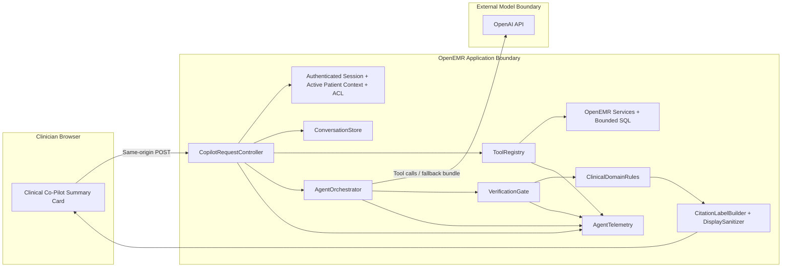

# AgentForge Clinical Co-Pilot — ARCHITECTURE

**Upstream:** [openemr/openemr](https://github.com/openemr/openemr/tree/master)  
**License context:** OpenEMR is GPL-3.0-or-later. This module and this document are additive work inside that upstream context.  
**Implementation location:** `interface/modules/custom_modules/oe-module-clinical-copilot/`  
**Namespace:** `OpenEMR\Modules\ClinicalCopilot`

---

## Status and truth-in-advertising note

This document describes the architecture **as it exists in this fork right now**.

Where I describe a production path beyond the current sprint, I label it clearly as a **forward path**. I am not claiming work that is not currently implemented in the repository.

That distinction matters in healthcare, and it matters even more for senior technical review. A polished document is not useful if it blurs the line between what is real now and what would still need to be built.

---

## One-page summary (~500 words)

This architecture is intentionally conservative.

I am integrating an AI agent into OpenEMR, not building a parallel clinical system beside it. OpenEMR is already a large, real-world EHR with a mixed architecture: modern PSR-4 services, legacy procedural code, established access-control patterns, and an existing clinician workflow. My design choice was to respect that reality and place the Clinical Co-Pilot **inside the existing OpenEMR trust boundary** rather than outside it.

The core decision is straightforward: **the AI agent does not expand trust; it inherits trust**. Every request starts from the same authenticated OpenEMR session the clinician is already using. The module operates against the active patient context already present in that session. The model is not given broad database access, does not receive an unrestricted API token, and does not decide which patient to retrieve. That scope is enforced by the application layer.

The target user is a **high-volume primary care physician** who has about **90 seconds between exam rooms**. That constraint shapes the whole design. The system should return a thin, high-signal briefing quickly, support follow-up questions, and clearly state uncertainty when the chart is incomplete. I chose speed with guardrails over completeness with drift. In a clinical context, a shorter answer that is grounded is more useful than a longer answer that sounds confident but cannot be defended.

The module is implemented as a custom OpenEMR module named `oe-module-clinical-copilot`. It is embedded into the patient summary workflow and uses a server-side request path. Data retrieval is handled by a constrained tool layer that reuses OpenEMR services and bounded SQL queries. Tools currently retrieve chart lists, recent encounters, and recent labs. These tools return structured JSON that is intentionally limited in scope. The model is a reasoning layer over that structured data, not a direct data-access layer.

Verification is a hard requirement, not a prompt suggestion. The model returns structured output containing factual statements and citation paths. A server-side `VerificationGate` removes any statement that cannot be resolved back to tool output. A second pass, `ClinicalDomainRules`, removes or downgrades language that would be unsafe in a clinical setting, such as unsupported diagnoses or unsafe medication phrasing. If a claim cannot be verified, it does not reach the clinician as fact.

Observability is also wired in as a first-class concern. `AgentTelemetry` records what happened, in what order, how long each step took, which tools failed, and what the token and estimated cost profile was. This makes the system debuggable and auditable.

Failure handling is explicit. Missing data, tool failures, malformed model JSON, or OpenAI transport issues return visible, structured degradation rather than silent invention.

In short, this architecture is designed around five priorities: **bounded access, verifiable output, explicit failure behavior, operational observability, and additive integration into a real EHR**. That is the right foundation for a trustworthy Clinical Co-Pilot.

---

## Table of contents

1. [Executive architecture position](#executive-architecture-position)  
2. [Users, workflow, and scope](#users-workflow-and-scope)  
3. [Design principles](#design-principles)  
4. [One-slide architecture visual](#one-slide-architecture-visual)  
5. [System components](#system-components)  
6. [Request path and runtime flow](#request-path-and-runtime-flow)  
7. [Trust boundaries and authorization](#trust-boundaries-and-authorization)  
8. [Tool layer](#tool-layer)  
9. [LLM integration](#llm-integration)  
10. [Verification system](#verification-system)  
11. [Observability](#observability)  
12. [Failure modes and graceful degradation](#failure-modes-and-graceful-degradation)  
13. [Evaluation strategy and current test coverage](#evaluation-strategy-and-current-test-coverage)  
14. [Deployment architecture](#deployment-architecture)  
15. [Scale, cost, and production path](#scale-cost-and-production-path)  
16. [Known limitations and honest tradeoffs](#known-limitations-and-honest-tradeoffs)  
17. [Direct answers for review panels and Gauntlet interview](#direct-answers-for-review-panels-and-gauntlet-interview)  
18. [Repository references](#repository-references)  
19. [Document control](#document-control)

---

## Executive architecture position

My architectural position for this sprint is:

1. **Keep the agent inside OpenEMR’s existing operational and authorization model.**
2. **Constrain the model to server-approved tools and bounded data.**
3. **Require verification before display.**
4. **Make failures visible and predictable.**
5. **Instrument the whole flow so it can be audited and improved.**

This is a multi-turn conversational module that operates under existing clinical context and system permissions and viewed within a card within the Patient dashboard .

This is also not a claim that AI is now a clinical authority. In this design, the model is an **untrusted reasoning component**. The application remains the authority for access control, data retrieval, verification, and presentation.

---

## Users, workflow, and scope

### Target user

The target user for this module is a **high-volume primary care physician**.

### Operational moment

The operational moment is the short window **between patient rooms**, when the physician needs to reconstruct context quickly enough to walk into the next visit prepared.

### What the physician needs

The physician needs a concise answer to questions such as:

- Who am I about to see?
- Why am I seeing them today?
- What changed since the last visit?
- Are there recent labs, medications, allergies, or problem-list items I should pay attention to right now?

### What this module is intended to do

The module provides:

- a **brief patient rooming summary**,
- a **multi-turn conversational surface** for follow-up questions,
- **explicit uncertainty handling** when the chart is incomplete,
- and **citation-backed statements** only.

### What this module is not intended to do

The module does **not** attempt to:

- make autonomous clinical decisions,
- place orders,
- diagnose patients,
- or operate as a general-purpose medical chatbot.

That boundary is deliberate and aligned with the PRD.

---

## Design principles

### 1) Inherit trust, do not expand it
The agent gets the same trust level as the active OpenEMR session, not more.

### 2) Minimum necessary data
Only the data needed for the active question and current patient should be sent to the model.

### 3) Verification before presentation
If a statement cannot be traced back to actual chart data, it does not appear as fact.

### 4) Fail by omission, not fabrication
When data is missing or a tool fails, the system should surface uncertainty or error, not guess.

### 5) Additive integration over invasive rewrites
The module should fit the existing codebase cleanly and avoid unnecessary disruption to core OpenEMR behavior.

### 6) Real observability from day one
If I cannot answer what the agent did, how long it took, and what it cost, then the system is not ready for serious review.

### 7) Honest production thinking
For anything not implemented in this sprint, I document the forward path rather than implying it already exists.

---

## One-slide architecture visual



### How to read this visual

- The **browser** hosts the clinician-facing card only.
- The **OpenEMR application boundary** owns authorization, patient context, tool execution, verification, rendering safety, and telemetry.
- The **external model boundary** is limited to reasoning over server-approved inputs.
- The model never speaks directly to the UI.

This is the same architecture I would present on a single slide to a review panel.

---

## System components

| Component | Location | Role |
|-----------|----------|------|
| Module bootstrap | `interface/modules/custom_modules/oe-module-clinical-copilot/openemr.bootstrap.php` | Registers module namespace and hooks module bootstrap into OpenEMR when enabled |
| Patient UI | `src/ClinicalCopilotCard.php` + `templates/clinical_copilot/summary_card.html.twig` | Renders the patient-facing summary card and form/UI surface |
| HTTP handler | `public/copilot_request.php` | Enters through same OpenEMR environment and dispatches request handling |
| Controller | `src/Controller/CopilotRequestController.php` | Coordinates request handling, session validation, tool orchestration, verification, and response formatting |
| Conversation state | `ConversationStore` | Maintains multi-turn context for the active conversation |
| Tool registry | `ToolRegistry` | Registers and executes allowed tools only |
| Tool implementations | `src/Services/Tools/` | Retrieve bounded patient data for the model |
| Orchestrator | `AgentOrchestrator` | Manages OpenAI interaction, tool-calling loop, and fallback flow |
| Verification | `VerificationGate` | Validates citation paths against actual tool output |
| Domain guardrails | `ClinicalDomainRules` | Applies clinical safety constraints to verified statements |
| Safe presentation | `CitationLabelBuilder` + `DisplaySanitizer` | Produces UI-safe citation labels and safe display text |
| Observability | `AgentTelemetry` | Emits structured telemetry for agent requests |

---

## Request path and runtime flow

The runtime flow is intentionally linear and auditable.

1. **Clinician opens a patient chart** and sees the Clinical Co-Pilot card in the patient summary area.
2. **Clinician submits a request** from the card using a same-origin POST.
3. The module’s `public/copilot_request.php` entrypoint loads the normal OpenEMR environment through `globals.php`.
4. `CopilotRequestController` validates the request context, including session and active patient context.
5. The controller uses the active session `pid` rather than accepting a patient id from the client.
6. `ConversationStore` provides conversation continuity for multi-turn interactions.
7. `ToolRegistry` executes only registered server-side tools.
8. The tools collect bounded JSON for the current patient.
9. `AgentOrchestrator` sends either tool-call interactions or a fallback merged bundle flow to OpenAI.
10. The model returns structured JSON with statements and citations.
11. `VerificationGate` removes any statement whose citation path does not resolve.
12. `ClinicalDomainRules` removes or downgrades statements that violate clinical guardrails.
13. `CitationLabelBuilder` and `DisplaySanitizer` prepare safe output for the UI.
14. The final response is returned to the summary card.
15. `AgentTelemetry` records the request, timing, tools used, and usage metrics.

This flow is deliberately not clever. In clinical systems, plain and inspectable is often better than elegant but opaque.

---

## Trust boundaries and authorization

### Core boundary statement

The trust boundaries in this design are explicit and enforced in application code.

| Boundary | What is allowed | What is not allowed |
|----------|------------------|----------------------|
| Browser ↔ OpenEMR | Same-origin request under existing OpenEMR session and CSRF model | Direct tool execution from the browser |
| OpenEMR ↔ Model | Minimum-necessary structured JSON over server-side HTTPS | Raw chart browsing by the model, unrestricted query access |
| Model ↔ Clinician | Verified, filtered, UI-safe statements only | Direct model output without server-side verification |

### Authorization model

Authorization is not delegated to the model.

The module binds access to:

- the **authenticated OpenEMR user session**,
- the **active patient context**,
- and **existing OpenEMR permissions**.

The controller uses the session `pid` as the patient scope. The browser does not get to tell the server which patient to retrieve, and the model does not get to request arbitrary patient records.

### Current ACL notes

- The co-pilot panel currently requires `patients` / `demo`.
- Recent lab retrieval additionally requires `patients` / `lab` inside `RecentLabsTool`.

### Why this matters

A useful review-panel answer here is:

> The model is not the trust boundary. OpenEMR is. The model only operates on data that has already passed through application-layer authorization.

---

## Tool layer

### Tool-layer design

The tool layer is intentionally constrained.

Each tool has:

- a fixed tool name,
- a defined parameter schema,
- bounded output JSON,
- server-chosen retrieval logic,
- and no authority to widen its own scope.

There is **no patient id in the tool parameters**. Patient scope comes only from the authenticated session.

There is also **no model-generated SQL**. Where SQL is used, it is chosen by server code and bounded by design.

### Implemented tools

| Tool name | Merge root | Purpose | Current implementation |
|-----------|------------|---------|------------------------|
| `get_chart_lists` | `chart_lists.*` | Allergies, medications, problems and similar chart-list context | Uses `PatientService` plus bounded `lists` SQL through `ChartContextTool` |
| `get_recent_encounters` | `recent_encounters.encounters.*` | Recent encounters, dates, categories, and visit reasons | Uses `EncounterService::getEncountersForPatientByPid` with caps |
| `get_recent_labs` | `recent_labs.labs.*` | Recent procedure/lab context | Uses bounded SQL across `procedure_result`, `procedure_report`, and `procedure_order` with ACL checks |

### Orchestration behavior

The current orchestration path supports:

- **OpenAI tool calls** with capped rounds, and
- a **fallback path** that passes a pre-merged `TOOL_BUNDLE_JSON` with `response_format: json_object` if the loop does not return parseable structured output.

### Why this design

This design is defensible because it narrows the model’s job to what the model is best at: reasoning over structured context and producing a concise explanation. It keeps authority for data access and scoping inside the application.

---

## LLM integration

### Current state

The current module uses the **OpenAI HTTP API**.

This sprint uses **synthetic demo data only**, in line with the project requirement. I am acting as if a BAA and training exclusion posture exist for the exercise, but I am not treating that assumption as a substitute for real production compliance work.

### Current implementation choices

- **Transport:** Server-side HTTPS from PHP
- **Secrets:** API key stored in server configuration / environment, not in frontend code
- **Prompting:** System instructions require citation-backed statements, explicit uncertainty, and active-patient-only scope
- **Response shape:** Structured JSON output suitable for server-side verification

### What the model is allowed to do

The model is allowed to:

- interpret user intent,
- request approved tools,
- summarize bounded chart context,
- maintain conversational continuity,
- and express uncertainty.

### What the model is not allowed to do

The model is not allowed to:

- decide access control,
- browse the database,
- generate arbitrary SQL,
- bypass verification,
- or present itself as the source of truth.

### Forward production path

If this system moves beyond synthetic sprint use, the forward path would include:

- signed BAA(s),
- verified subprocessor review,
- minimum-necessary payload discipline,
- explicit data retention controls,
- and potentially **Azure OpenAI** or **OpenAI Enterprise** depending on organizational requirements.

For broader standards-based interoperability, the documented future path is **OAuth2-scoped FHIR or Standard API tools**, while preserving the same core rule: authorization remains with the application, not the model.

---

## Verification system

Verification is the most important technical control in this module.

### Verification objective

Every factual statement presented to the clinician should be traceable to a source in the current patient’s record.

### Current response contract

The model is expected to return JSON shaped roughly like this:

```json
{
  "statements": [
    {
      "text": "The patient has recent labs on file.",
      "citations": ["recent_labs.labs.0"]
    }
  ],
  "uncertainties": [
    "Reason for today's visit is not clearly documented in the recent encounter notes."
  ]
}
```

### Verification pipeline

1. **Tool output is collected** into merged in-memory JSON roots such as `chart_lists`, `recent_encounters`, and `recent_labs`.
2. **Model output is parsed** as structured JSON.
3. **`VerificationGate` resolves citation paths** against the actual merged tool output.
4. Any statement with a missing, invalid, or unresolved citation is **removed**.
5. **`ClinicalDomainRules` applies secondary constraints** to verified statements.
6. **Safe, verified statements only** are passed to the UI.

### Domain constraints

`ClinicalDomainRules` is a second defensive layer. It is designed to catch patterns that may be technically cited but still inappropriate to present as-is, including:

- unsafe medication or dosing language,
- unsupported “new diagnosis” phrasing,
- overly definitive statements where context is incomplete,
- and other clinically risky phrasing that should be filtered or softened.

### Why I chose this design

I chose a server-side verification gate because a prompt-only approach is not enough for a clinical system. Prompting can influence behavior. It cannot guarantee it.

The practical rule is:

> If a claim cannot be verified against chart-derived data, it should not be stated as fact.

### Known limitation

Verification proves that a claim maps to available tool data. It does **not** magically solve every clinical nuance. That is why domain constraints and conservative scope still matter.

---

## Observability

The PRD requires observability that can answer, from logs:

- what the agent did,
- in what order,
- how long each step took,
- which tools failed,
- and what the token/cost usage was.

### Options considered

| Option | Pros | Cons | PHI risk |
|--------|------|------|----------|
| Cloud tracing platform | Rich trace views and dashboards | Third-party subprocessor exposure | Higher if prompts are logged carelessly |
| Self-hosted trace store | Strong control and deployment flexibility | Additional operational burden | Medium if redaction is weak |
| OpenEMR DB audit table | Stays in application boundary | Requires schema and migration work | Lower with redacted fields |
| PHP JSON logs | Fastest path for sprint and easy to wire in | Less polished visualization | Lower with redaction |

### Current implementation

For this sprint, I implemented the **PHP JSON log** path through `AgentTelemetry`.

`AgentTelemetry` captures:

- request-level identifiers,
- ordered step marks,
- wall-clock offsets / timing,
- success/failure state,
- redacted detail strings,
- token usage,
- model id,
- and estimated USD cost.

These telemetry records are emitted as structured JSON log lines under the OpenEMR app logger for the clinical co-pilot telemetry stream.

### UI vs server observability

The patient card may show aggregate token usage and estimated cost on successful requests. Detailed step traces remain **server-side**, which is the correct default for this kind of system.

### Why this design is appropriate now

For the sprint, structured logs are enough to prove observability is real and wired in. For production, I would likely move to a self-hosted trace store or a dedicated internal audit/trace subsystem before allowing live PHI to flow.

---

## Failure modes and graceful degradation

Healthcare systems need predictable failure behavior.

The current module is designed to degrade honestly rather than improvise.

| Failure mode | Current behavior |
|--------------|------------------|
| Tool returns no rows | Tool output includes empty arrays and/or `note` fields; model is expected to surface uncertainty |
| Tool ACL block | Tool output returns a bounded result with a note such as `insufficient_acl` |
| Partial chart / missing data | Agent may omit sections and should surface uncertainty rather than fabricate data |
| Model returns malformed JSON | Response returns explicit error such as `malformed_model_json`; UI shows the error line |
| OpenAI transport or API failure | Response returns explicit error such as `openai_failure`, `missing_openai_api_key`, or network-related failure |
| Verification failure | Unverifiable statements are dropped before reaching the clinician |
| Domain safety filter hit | Unsafe statements are removed or downgraded and the transcript indicates filtering occurred |

### Current non-features worth stating honestly

The module currently does **not** implement:

- automatic JSON repair retries,
- a server-side “last known good” briefing cache,
- or complex partial-result recovery across independently timed-out tools.

Those are valid future improvements, but they are not claimed as current behavior.

### Why this failure model is acceptable for the sprint

The sprint requirement is graceful degradation and transparent error handling. The current implementation satisfies that bar by failing visibly and predictably.

---

## Evaluation strategy and current test coverage

A convincing eval strategy in this domain cannot only confirm happy paths. It needs to exercise failure modes and safety behavior.

### Evaluation goals

The current evaluation design focuses on:

- structured output correctness,
- citation verification behavior,
- domain-rule filtering,
- tool registry behavior,
- safe handling of malformed model responses,
- and resilience to incomplete or empty data.

### Current test organization

Current isolated PHPUnit coverage lives under:

- `tests/Tests/Isolated/ClinicalCopilot/`

### Representative implemented isolated tests

The current architecture document and code reference these categories/tests:

- `VerificationGateIsolatedTest`
- `ClinicalDomainRulesTest`
- `ToolRegistryIsolatedTest`
- `CitationLabelBuilderTest`
- `OpenAiClientMergeUsageIsolatedTest`

### What the current eval covers well

- citation stripping for invalid or missing paths,
- domain-rule enforcement,
- tool registry behavior without requiring a full DB harness,
- merged usage accounting,
- and safe label generation.

### What still deserves expansion

The next valuable additions are:

- negative authorization integration tests against a real DB-backed harness,
- more explicit ambiguous-query conversational tests,
- and additional tool/OpenAI timeout simulation.

### How to run the isolated suite

- `composer dump-autoload -o`
- `composer phpunit-isolated -- --filter ClinicalCopilot`

or:

- `vendor/bin/phpunit -c phpunit-isolated.xml --filter ClinicalCopilot`

### Eval position for review

A direct review-panel answer here is:

> My eval strategy is intentionally safety-oriented. I care less about proving a pretty happy-path demo and more about proving that unverifiable claims are removed and failure conditions degrade predictably.

---

## Deployment architecture

### Stage 1: local development

The canonical local environment for this fork is the **Easy Development Docker** stack under:

- `docker/development-easy/`

The summarized local defaults documented in the repository are:

- application at `http://localhost:8300/` or `https://localhost:9300/`
- default login `admin / pass`
- phpMyAdmin at `http://localhost:8310/` when enabled

This environment is intended for local development and testing with **synthetic sample data only**.

### Stage 2: public deployment

The public deployment for the sprint is:

- `https://openemr-210925-0.cloudclusters.net/`

The selected hosting platform is **Cloud Clusters managed OpenEMR**.

### Why this hosting choice is reasonable for the sprint

The main reasons were practical:

- it provides a live, reachable OpenEMR deployment quickly,
- it aligns with a deployment shape current OpenEMR users can recognize,
- and it keeps the Week 1 focus on architecture, integration, and behavior rather than spending the sprint building unrelated infrastructure.

### Deployment posture

The current deployment posture should be understood as a **public sprint deployment**, not a final production-hardening claim.

Before any live PHI or true production use, I would still require:

- confirmed HTTPS and cookie posture,
- secret management validation,
- log redaction review,
- backup/restore policy validation,
- rollback plan,
- runtime version validation,
- and full compliance review for the chosen model provider and infrastructure.

---

## Scale, cost, and production path

### Actual spend vs planning

The PRD asks for actual development spend and projected production thinking at 100 / 1K / 10K / 100K users.

This document can truthfully provide the **architectural implications** now. Actual spend figures should be populated from real billing/export data rather than invented.

### Cost drivers

The major cost drivers are not just “users × tokens.” They include:

- number of requests per clinician,
- number and size of tool payloads,
- token cost of tool-heavy prompts,
- multi-turn conversation length,
- verification and retry patterns,
- and any caching or routing strategy used at scale.

### Architectural implications by scale

| Scale | Architectural implication |
|-------|---------------------------|
| ~100 active users | Single-region deployment, basic rate limiting, shared API budgeting |
| ~1K active users | More deliberate request throttling, improved telemetry review, possible short-lived redacted caching where policy allows |
| ~10K active users | Regional deployment strategy, aggressive minimum-necessary prompts, model tiering, and stronger internal observability systems |
| ~100K active users | Dedicated inference contracts, stronger isolation, potential VPC/private deployment models, cost allocation by site/department |

### 500-bed hospital / 300 concurrent clinical users

For the interview and review context, my honest answer is:

- I would not scale this by simply sending more raw chart context to a larger model.
- I would tighten the tool payloads further.
- I would separate routing from heavier reasoning.
- I would harden observability and internal auditability.
- I would revisit infrastructure placement, concurrency controls, and model-provider posture before asking clinicians to depend on it.

### Forward production path

A realistic next production path would include:

- stronger provider and infrastructure controls,
- deeper auditability,
- a hardened authorization and scope review,
- expanded eval coverage,
- and standards-based API tooling where appropriate.

---

## Known limitations and honest tradeoffs

This section is intentionally direct.

### What is strong in the current design

- The trust boundary is clear.
- Verification is server-side and mandatory.
- The module is additive rather than invasive.
- Observability is real and wired in.
- Failure behavior is explicit.

### What is intentionally constrained

- Current tool surface is narrow by design.
- The sprint uses synthetic data only.
- Observability is log-based, not a polished trace UI.
- The public deployment is a sprint deployment, not a claim of final production readiness.
- Full FHIR/OAuth2-based tooling is a documented future path, not the current sprint implementation.

### Tradeoffs I made deliberately

#### Speed vs completeness
I prioritized fast, bounded summaries over exhaustive chart synthesis.

#### Integration vs abstraction purity
I chose to work inside OpenEMR’s actual architecture instead of abstracting everything behind a new platform layer.

#### Safety vs fluency
I prefer shorter, verified, sometimes conservative output over more fluent but less defensible text.

#### Sprint realism vs theoretical architecture
I documented a production path without pretending the sprint already solved every production concern.

---

## Direct answers for review panels and Gauntlet interview

This section is written intentionally in direct-answer format.

### Why did you design the verification layer this way?

Because in a clinical setting, prompt discipline is not enough. I needed a server-side control that enforces source attribution after the model responds. The model can suggest a statement, but the application must decide whether that statement is supported by chart-derived data. That is why I use structured citations plus a `VerificationGate`, followed by `ClinicalDomainRules`.

### What does the agent do when a tool fails or a record is missing?

It degrades explicitly. Tools return bounded JSON with notes or empty sections. The model is instructed to surface uncertainty rather than invent missing facts. If the model returns malformed output or the API fails, the user gets a visible structured error rather than a silent fallback.

### Where are the trust boundaries in your system, and how are they enforced?

The trust boundaries are between the browser and OpenEMR, between OpenEMR and the model provider, and between the model and the clinician-facing UI. OpenEMR remains the authority for session validation, patient scoping, tool execution, verification, and final display. The model never gets direct authority over access control or UI output.

### What would you have missed if you had skipped the audit and gone straight to building?

I would have risked building a more impressive-looking agent with a weaker trust model. The audit forces clarity around OpenEMR’s actual integration points, authorization constraints, data quality issues, and HIPAA-shaped failure risks. It changes the architecture from “AI feature” thinking into “clinical system” thinking.

### What failure mode worries you most, and why?

The failure mode that worries me most is a confident but unsupported clinical statement getting through to the clinician. That is more dangerous than a visible error because it looks useful while quietly eroding trust and potentially harming care. That is why verification is the center of the design.

### How would you scale this to a 500-bed hospital with 300 concurrent clinical users?

I would first harden the operational model rather than just increase capacity. That means tighter payload control, stronger concurrency and rate controls, deeper auditability, likely a more formal internal trace system, and a more formal model-provider/infrastructure posture. I would also revisit whether certain summaries should be precomputed or routed through lighter-weight models before heavier reasoning.

### What would you need to change before you would be comfortable with a real physician relying on this?

I would need stronger eval coverage, fuller production compliance validation, stricter operational controls, more mature trace/audit handling, deeper user testing with clinicians, and a validated deployment/provider posture for real PHI. The current sprint design is a strong foundation, but I would not blur the difference between foundation and final clinical dependence.

### Why is a conversational agent the right interface instead of a dashboard widget?

Because the chosen user and workflow are not asking for more static surface area. The physician needs a concise briefing first and then the ability to ask a follow-up question in context without manually hunting through several parts of the chart. Multi-turn conversation is justified here because the workflow naturally includes a primary summary followed by quick clarification.

### Why did you keep the agent inside OpenEMR instead of building a separate service around it?

Because the hardest part of this problem is not generating text. It is preserving the correct trust, context, and access boundaries in a real clinical system. Embedding the module inside OpenEMR keeps the integration closer to the actual workflow and reduces the risk of creating a second, less-governed trust surface.

### What is the shortest accurate description of this architecture?

It is a server-side, verification-gated, observability-instrumented conversational agent embedded inside OpenEMR and scoped to the authenticated clinician session plus active patient context.

---

## Repository references

| Topic | Location |
|-------|----------|
| Clinical Co-Pilot module | `interface/modules/custom_modules/oe-module-clinical-copilot/` |
| Module request entrypoint | `interface/modules/custom_modules/oe-module-clinical-copilot/public/copilot_request.php` |
| Orchestration | `interface/modules/custom_modules/oe-module-clinical-copilot/src/Services/AgentOrchestrator.php` |
| Tools | `interface/modules/custom_modules/oe-module-clinical-copilot/src/Services/Tools/` |
| Module config | `interface/modules/custom_modules/oe-module-clinical-copilot/moduleConfig.php` |
| Front controller | `public/index.php` |
| Bootstrap | `bootstrap.php` |
| Modern services | `src/Services/` |
| API / future standards path | `Documentation/api/` |
| Audit document | `AUDIT.md` |
| Users and use cases | `USERS.md` |
| Local and contribution guidance | `CONTRIBUTING.md`, `CLAUDE.md`, `DOCKER_README.md`, `README-Isolated-Testing.md` |

---

## Document control

| Field | Value |
|-------|-------|
| Project | AgentForge — Clinical Co-Pilot |
| Document type | Architecture |
| Audience | Senior AI engineers, architects, CTOs, healthcare technical reviewers, and federal-style review panels |
| Implementation scope | Current repository state plus clearly labeled production forward path |
| Companion documents | `AUDIT.md`, `USERS.md`, repository setup/testing docs |
| Status | Current as of this rewrite |

