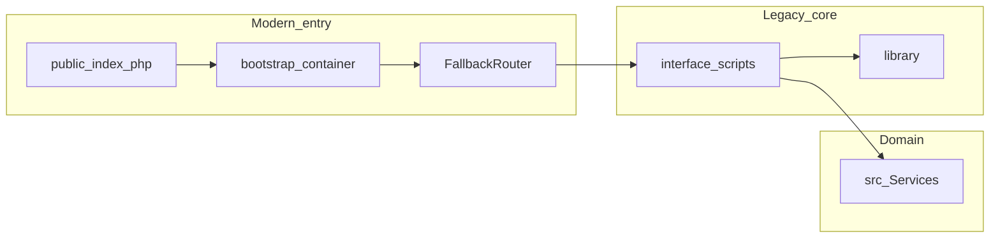

# AgentForge Clinical Co-Pilot — System and fork audit

**Upstream:** [openemr/openemr](https://github.com/openemr/openemr/tree/master)  
**Scope:** What I actually read in this tree—`public/index.php` / `bootstrap.php`, [`src/BC/FallbackRouter.php`](src/BC/FallbackRouter.php), module entry [`interface/modules/custom_modules/oe-module-clinical-copilot/public/copilot_request.php`](interface/modules/custom_modules/oe-module-clinical-copilot/public/copilot_request.php), [`CopilotRequestController.php`](interface/modules/custom_modules/oe-module-clinical-copilot/src/Controller/CopilotRequestController.php), tools under `src/Services/Tools/`, plus repo docs (`CLAUDE.md`, `Documentation/api/README.md`, `.github/SECURITY.md`). **No production PHI**—synthetic demo data only.

This audit feeds [USERS.md](USERS.md) and [ARCHITECTURE.md](ARCHITECTURE.md). If a clinic plugged real charts in tomorrow, I’d re-verify every row below; relabeling the doc wouldn’t be enough.

---

## Lead: what I expected vs what I found

I expected “modern OpenEMR” to mean one clean request pipeline. Tracing `public/index.php` shows the container comes up in `bootstrap.php`, then a lot of traffic still resolves through **legacy script includes**—[`FallbackRouter`](src/BC/FallbackRouter.php) is literally documented as setting up routing *“as if the request was being processed directly by the target file.”* That single class changed how I scoped the co-pilot: **additive** module + small POST entrypoint, not a parallel microservice stack that pretends the rest of the app is already Laminas-clean.

The upside: you can ship inside the same session, same `pid`, same ACL helpers the rest of the chart uses. The downside: **uniform security and audit behavior is not automatic** on every path—new code has to re-assert CSRF, ACL, and “what got logged” the way `CopilotRequestController` does explicitly.

**Bottom line for the fork:** OpenEMR is a fine host for a session-bound co-pilot if you **shrink integration surface**: bounded tools, server-side verification, redacted telemetry, and an honest list of what still needs DB-backed ACL tests before production.

---

## Table of contents

1. [Security audit](#security-audit)  
2. [Performance audit](#performance-audit)  
3. [Architecture audit](#architecture-audit)  
4. [Data quality audit](#data-quality-audit)  
5. [Compliance and regulatory audit](#compliance-and-regulatory-audit)  
6. [Prioritized findings](#prioritized-findings)  
7. [What this audit changed in the architecture](#what-this-audit-changed-in-the-architecture)  
8. [References](#references)

---

## Security audit

### Authentication and session model

Staff flows use the normal **web session** from `interface/` login (not line-audited here). The co-pilot AJAX path checks `authUser` on the session, CSRF via `CsrfUtils::checkCsrfInput`, then proceeds—see `CopilotRequestController::handle()`.

OAuth2 / FHIR under `Documentation/api/` is the **future** path if tools ever need to leave process; Week 1 stays in-process.

### Authorization risks

| Risk | Description | Mitigation in Co-Pilot | Wired where |
|------|-------------|-------------------------|---------------|
| **IDOR / wrong patient** | Client sends a `pid` you trust by mistake | Use **session `pid` only** for tool execution; POST body does not select patient | `CopilotRequestController` casts `(int) ($session->get('pid') ?? 0)` and passes that to the orchestrator |
| **Over-privileged tools** | “Read everything” tools | Bounded JSON, capped rows, domain-specific tools | `RecentEncountersTool::MAX_ROWS`, `RecentLabsTool` LIMIT + join; `ChartListsTool` wraps `ChartContextTool` |
| **Prompt injection** | Free text in chart lists | Data ≠ instructions; tool allowlist; structured output + strip | System prompt in `AgentOrchestrator::buildSystemPrompt()`; `VerificationGate` drops uncited lines |

**PHI exposure vectors** (unchanged facts): web access logs if IDs hit query strings; PHP error logs with stack/SQL; LLM vendor retention; third-party APM (**including optional Langfuse** when enabled); Cloud Clusters control-plane logs. Module default: **no raw prompts in client-visible meta**; `AgentTelemetry` is server-side JSON logging with redaction hooks; Langfuse defaults to **metadata-only** exports unless an explicit env enables truncated previews—see [ARCHITECTURE.md](ARCHITECTURE.md) and the module README.

---

## Performance audit

| Area | Observation | Impact on agent |
|------|-------------|-----------------|
| Monolith + DB | Unbounded chart reads hurt | Tools use caps and bounded SQL (`RecentLabsTool`, encounters slice) |
| Cold start | First include wave can be heavy | Dedicated `copilot_request.php` entry keeps the blast radius smaller than a full dashboard |
| LLM RTT | Usually dominates PHP | `AgentOrchestrator` marks each OpenAI round in telemetry; tool loop capped at 5 rounds |

**What I’m not claiming:** p95 numbers on demo hardware. **What I’d measure first** with the telemetry already in place: wall time for `tools_collect_merged`, distribution of OpenAI round count (tool loop vs fallback), and payload size of merged JSON before it hits the model. Until those are captured in a runbook, any “sub-second tools” line is a goal, not a measurement.

---

## Architecture audit

| Layer | Location | Notes |
|-------|----------|--------|
| Front controller | `public/index.php`, `bootstrap.php` | Container bootstrap; not every request is “modern MVC only.” |
| Routing bridge | `src/BC/FallbackRouter.php` | Legacy includes—**this** is why I treat integration as incremental. |
| Domain services | `src/Services/` | `EncounterService`, `PatientService` patterns the tools reuse. |
| Module | `interface/modules/custom_modules/oe-module-clinical-copilot/` | Custom module boundary for the co-pilot. |
| APIs | `Documentation/api/` | Production-grade external path later. |

---

## Data quality audit

| Issue | Agent impact | Mitigation in module |
|-------|----------------|----------------------|
| Missing encounter `reason` | “Why today?” falls apart | Model instructed to put gaps in `uncertainties`; verification doesn’t invent paths |
| `lists` polymorphism | Same table shape for problems/meds/allergies | One merge root `chart_lists.*`—simpler citations, fewer “wrong list” bugs |
| Med list vs real-world use | Wrong story if you imply adherence | Wording stays “recorded meds”; polypharmacy path in `ClinicalDomainRules` |
| PDF-only labs | No structured parse | Out of sprint—`RecentLabsTool` only sees `procedure_*` rows |
| Duplicate problems | Noisy summary | Forward: dedupe in tool layer ([USERS.md](USERS.md) UC2) |

---

## Compliance and regulatory audit

**Disclaimer:** Engineering notes, not legal advice.

### HIPAA-shaped controls (fork today)

| Safeguard | What we actually do now | Gap / forward |
|-----------|-------------------------|---------------|
| **Access** | Session auth + CSRF + `AclMain::aclCheckCore('patients', 'demo')` on co-pilot; `RecentLabsTool` adds `patients`/`lab` | Role matrix beyond demo user; negative tests on ACL |
| **Audit** | `AgentTelemetry` structured steps + redacted strings; no dedicated DB audit table for co-pilot reads | Append-only internal audit table if PHI deployment |
| **Integrity** | Server returns verified JSON; no client-side “trust the model” | Tamper-evident storage only if product requires it |
| **Transmission** | Same-origin POST; HTTPS assumed for production browser + OpenAI HTTPS from PHP | Verify TLS/cookie flags on each deploy target |

### LLM subprocessors (OpenAI)

Class exercise assumes BAA / no-training posture **per program** while using **synthetic data only**. Real PHI needs written vendor terms, region choice, and likely Azure OpenAI or enterprise channel—verify at deploy time, don’t copy from this doc.

### Cloud Clusters

Public demo host: app-level redaction is ours; provider backups, support access, and panel logs are theirs. Before non-demo: document who can pull backups and where those files must not land.

---

## Prioritized findings

| ID | Severity | Finding | Recommendation | Mitigation status |
|----|----------|---------|----------------|-------------------|
| F1 | High | LLM + logs can leak PHI | Redact; no raw prompts to third-party APM | **Partial** — `AgentTelemetry` redaction; optional Langfuse dual-write (opaque ids, metadata-default; env-gated redacted I/O); Langfuse = additional **subprocessor** (contract/BAA or self-host before PHI); ops review for prod |
| F2 | High | New endpoints can skip ACL | Enforce patient + permission on every tool | **Partial** — controller + lab tool ACL; needs broader matrix / DB tests |
| F3 | Medium | Legacy surface → uneven audit trails | Reuse services; isolated tests today, integration tests forward | **Partial** — isolated suite exists; integration harness forward |
| F4 | Medium | Bad EHR data → “hallucination-shaped” outputs | Verification + missing-data UX | **Done** for uncited claims; clinical nuance still hard |
| F5 | Low | Multi-tool / multi-round cost surprises | Cap rounds; measure merged payload | **Partial** — caps exist; profiling forward |

---

## What this audit changed in the architecture

- **Stopped pretending greenfield:** `FallbackRouter` forced “additive module + explicit ACL/CSRF on the co-pilot POST” instead of assuming a single modern router owns everything.
- **Split tools instead of one mega-dump:** bounded domains map to clearer citations and smaller blast radius when a query is wrong (performance + F4).
- **Double gate on labs:** controller demo ACL + `RecentLabsTool` lab ACL—directly from F2-style worry about feature teams forgetting secondary checks.
- **Telemetry first:** F1 means “pretty traces” lose to “redacted JSON lines we can grep.”

---

## References

| Artifact | Path |
|----------|------|
| PRD (Week 1 intent) | [`.cursor/rules/agentforge-clinical-copilot-requirements.mdc`](.cursor/rules/agentforge-clinical-copilot-requirements.mdc) |
| Architecture | [ARCHITECTURE.md](ARCHITECTURE.md) |
| Personas / use cases | [USERS.md](USERS.md) |
| Co-pilot controller | `interface/modules/custom_modules/oe-module-clinical-copilot/src/Controller/CopilotRequestController.php` |
| Fallback router | `src/BC/FallbackRouter.php` |
| Patient service (pattern) | `src/Services/PatientService.php` |
| API docs | `Documentation/api/README.md` |
| Dev standards | `CLAUDE.md` |
| Security disclosure | `.github/SECURITY.md` |

---

## Document control

| Field | Value |
|--------|--------|
| **Project** | AgentForge — Clinical Co-Pilot |
| **Companion documents** | [USERS.md](USERS.md), [ARCHITECTURE.md](ARCHITECTURE.md) |
