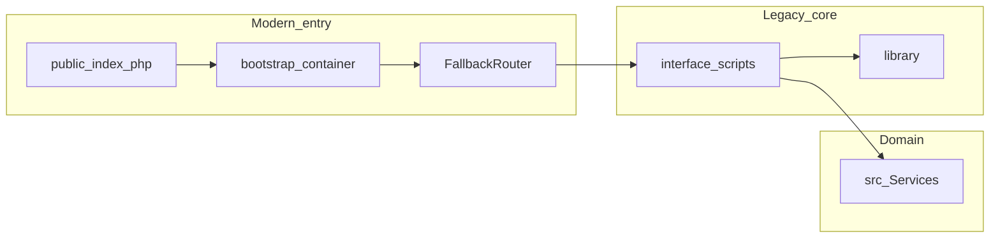

# AgentForge Clinical Co-Pilot — System and fork audit

**Upstream:** [openemr/openemr](https://github.com/openemr/openemr/tree/master)  
**Audit scope:** Baseline OpenEMR architecture and security posture **as observed in repository documentation and representative entrypoint code**, plus **HIPAA-relevant implications** for integrating a Clinical Co-Pilot. This audit supports [USERS.md](USERS.md) and is the **primary input** to the forward-looking integration plan in [ARCHITECTURE.md](ARCHITECTURE.md) (PRD Stage 5 synthesizes audit + users into architecture). **No production PHI** is used in class work—findings assume **synthetic demo data** unless otherwise noted.

---

## One-page summary (~500 words)

OpenEMR is a large, long-lived **PHP monolith** combining modern and legacy layers: PSR-4 code under `src/` (namespaced `OpenEMR\`), procedural and template-driven UI under `interface/` and `library/`, optional **Laminas MVC** modules, and a **progressive front controller** in `public/index.php` that loads a **PSR-11 container** from `bootstrap.php` then includes legacy scripts via `OpenEMR\BC\FallbackRouter`. That hybrid model is a **strength** for incremental features but a **risk** for uniform security policy: not every path inherits the same hardening or logging discipline, and new features must **explicitly** reapply authorization, output encoding, and audit expectations.

For **HIPAA-aligned design**, the critical dimensions are **where PHI lives** (database, session, logs, backups), **how it moves** (TLS to clients and to subprocessors such as LLM vendors), **who can access it** (role-based access, patient context, API scopes), and **what is logged** (application logs, web server logs, APM traces). OpenEMR provides **serious building blocks**: documented **OAuth2 / FHIR / SMART** flows under `Documentation/api/`, security disclosure processes in `.github/SECURITY.md`, extensive automated testing and static analysis (see `CLAUDE.md` and CI badges in `README.md`), and domain services such as `OpenEMR\Services\PatientService` that centralize data access patterns for modern code. **Gaps** remain: legacy patterns documented in `CLAUDE.md` (globals, mixed-era templates) increase **review burden** and the chance of **inconsistent audit trails** for novel features if implementers bypass established services.

**Performance** for an AI co-pilot is dominated by **LLM latency** and **tool fan-out** (database reads, serialization). OpenEMR’s traditional pages can be **heavy** on first load; an agent that issues **wide** queries will amplify bottlenecks. The audit recommends **bounded tools**, **parallelism only where safe**, and **progressive disclosure** of detail to meet **sub-minute** PCP expectations from [USERS.md](USERS.md).

**Data quality** is uneven in any real EHR: duplicate problems, stale meds, scanned PDFs versus structured entries, and unsigned notes. **Agent failure modes** mirror these gaps; verification must treat **missing** and **ambiguous** as first-class outcomes.

**Compliance:** Class deployment uses **synthetic chart text** and may call **OpenAI’s API**, with the Week 1 **public** runtime on **[Cloud Clusters OpenEMR Docker hosting](https://www.cloudclusters.io/cloud/openemr)** (managed SMB-oriented hosting—not Railway). For **production PHI**, this would still require **Business Associate Agreements**, **minimum necessary** payloads, **training / retention** guarantees, subprocessors review, and likely **Azure OpenAI** or equivalent enterprise contracts. **Public observability SaaS** remains **high risk** for PHI unless redacted; for Cloud Clusters, maintain **server-side redacted logs**, understand **hosting-provider** log and backup retention, and keep PHI out of platform telemetry (see [ARCHITECTURE.md](ARCHITECTURE.md)).

**Bottom line:** OpenEMR is a **credible foundation** for a **session-bound, in-process** Clinical Co-Pilot that **reuses existing authorization layers** and limits LLM exposure to **necessary structured excerpts**. The highest-impact audit outcome is **not** “avoid OpenEMR,” but **control integration surface area**: strict tool contracts, mandatory verification, **no PHI in third-party traces**, and a documented **upgrade path** to OAuth2-scoped APIs before real clinical deployment.

---

## Table of contents

1. [Security audit](#security-audit)  
2. [Performance audit](#performance-audit)  
3. [Architecture audit](#architecture-audit)  
4. [Data quality audit](#data-quality-audit)  
5. [Compliance and regulatory audit](#compliance-and-regulatory-audit)  
6. [Prioritized findings](#prioritized-findings)  
7. [References](#references)

---

## Security audit

### Authentication and session model

- Staff workflows rely on traditional **web session** authentication established through `interface/` login flows (not re-audited line-by-line here).
- **API access** can follow **OAuth2** as documented in `Documentation/api/`—relevant for **future** tool paths, not required for the sprint’s **in-process** approach ([ARCHITECTURE.md](ARCHITECTURE.md)).

### Authorization risks

| Risk | Description | Mitigation in Co-Pilot |
|------|-------------|-------------------------|
| **IDOR / wrong patient** | Agent UI might pass patient identifiers incorrectly. | Bind tools to **server-side active patient** from session; ignore client-supplied IDs except as signed opaque tokens if needed. |
| **Over-privileged tools** | Tools that read entire chart. | **Field-limited** tool outputs; separate tools per domain. |
| **Prompt injection** | Chart text contains adversarial instructions. | Treat chart text as **data**, not instructions; system prompt hardening; tool allowlists. |

### Data exposure vectors

- **Web server access logs** (URLs may leak identifiers if query strings are misused).
- **PHP error logs** (stack traces can include SQL or paths).
- **LLM vendor logs** (policy-dependent; assume sensitive).
- **Observability third parties** (default: **do not send** raw prompts/responses).
- **Platform / hosting logs (Cloud Clusters)** (treat as sensitive operational telemetry; keep PHI out of log lines).

### PHI handling gaps (inherent to integration, not solely OpenEMR)

- Any new endpoint must **mirror** existing ACL checks; absence is a **finding** on the fork’s implementation until proven by tests.

---

## Performance audit

| Area | Observation | Impact on agent |
|------|-------------|-----------------|
| Monolith + DB | Chart reads can be **expensive** when unbounded. | Tool queries must be **windowed** and indexed-friendly. |
| Cold start | First request may load many includes. | Prefer **small** agent endpoints; lazy-load heavy deps. |
| LLM RTT | Often **dominant** vs PHP. | Minimize round-trips; combine tools where safe. |

**Suggested budgets (planning, not measured here):**

- **Tools total:** target \< **1–2 s** p95 on demo hardware for initial briefing payload.
- **Model:** depends on OpenAI model choice; stream tokens to UI if used.

---

## Architecture audit

| Layer | Location (examples) | Notes |
|-------|---------------------|--------|
| Front controller | `public/index.php`, `bootstrap.php` | DI container without DB in bootstrap (by design). |
| Routing bridge | `src/BC/FallbackRouter.php` | Resolves to legacy script includes; large legacy surface. |
| Modern domain logic | `src/Services/` | Preferred integration point for tools. |
| UI / legacy | `interface/`, `library/` | High variety; integration should be **additive**. |
| APIs / interop | `Documentation/api/` | Production-grade external integration path. |

---

## Data quality audit

| Issue | Agent impact | Mitigation |
|-------|----------------|-------------|
| Missing visit reason | Cannot infer “why today” | Explicit **missing** state |
| Duplicate problems | Confusing summary | De-duplicate in tool layer |
| Med list vs actual use | Wrong med story | Label as “recorded meds” |
| PDF-only labs | Model cannot parse | Omit or OCR **out of sprint** |

---

## Compliance and regulatory audit

**Disclaimer:** This section is **engineering guidance**, not legal advice.

### HIPAA themes relevant to the Co-Pilot

| Safeguard category | Question for the fork | Status |
|---------------------|-------------------------|--------|
| **Access (§164.312(a)(1))** | Are agent endpoints user- and role-bound? | **Design required** |
| **Audit (§164.312(b))** | Are agent reads/writes logged appropriately? | **Design required** |
| **Integrity (§164.312(c)(1))** | Can prompts/responses be tampered post hoc? | Mitigate with **append-only** internal audit if needed |
| **Transmission (§164.312(e)(1))** | TLS to browser and to OpenAI | **Required** |

### LLM subprocessors (OpenAI)

- Review **BAA availability** (often via **Azure OpenAI** or enterprise programs for covered entities).
- Contract terms: **no training** on customer API data (verify current OpenAI / Microsoft documentation at deployment time).
- **Minimum necessary:** send **structured excerpts**, not full charts.

### Breach notification and retention

- If logs contain **PHI**, they become **high-sensitivity assets** with retention limits.
- Sprint approach: **synthetic PHI only**; logs **redacted**.
- On **Cloud Clusters** managed OpenEMR, document the ownership split: app-level redaction is your responsibility; **provider** control panel, backups, WAF, and support access paths must be explicitly reviewed for anything beyond synthetic demo data.

### Cloud Clusters operational controls (Week 1 hosting model)

- Keep all secrets (DB, OpenEMR admin, **OpenAI API keys**) in the **provider control panel** and OpenEMR secured configuration—never commit secrets or bake them into custom images you push to git.
- Pin **data center / region** deliberately and verify data-flow implications for OpenAI API egress and subprocessors.
- Use vendor **backup / restore** features per plan; define who can download backups and where those files may **not** be stored (e.g. unencrypted consumer cloud) before any non-demo usage.

### BAA assumption (per PRD)

Gauntlet Week 1 PRD: act **as if** a **Business Associate Agreement** (or equivalent) covers LLM vendors and that customer API data is **not used for model training**—while still using **demo / synthetic data only** in this codebase. Before any **real PHI**, replace that assumption with **written** vendor posture (BAA, retention, subprocessors, regions).

---

## Prioritized findings

| ID | Severity | Finding | Recommendation |
|----|----------|---------|----------------|
| F1 | High | LLM + observability can **exfiltrate PHI** via logs (including platform logs) | Redact aggressively; prefer in-app redacted traces and strict platform log controls |
| F2 | High | New agent endpoints could **skip ACL** if rushed | Central middleware enforcing patient + permission |
| F3 | Medium | Legacy surface increases **audit inconsistency** | Reuse `src/Services` patterns; add tests |
| F4 | Medium | Data quality causes **hallucination-like** failures | Verification + “missing data” UX |
| F5 | Low | Performance surprises under multi-tool calls | Bounded concurrency + profiling |

---

## References

| Artifact | Path |
|----------|------|
| PRD | `PRD_Week1_AgentForge.md` |
| Architecture decisions | [ARCHITECTURE.md](ARCHITECTURE.md) |
| Personas / use cases | [USERS.md](USERS.md) |
| Front controller | `public/index.php` |
| Bootstrap / DI | `bootstrap.php` |
| Fallback router | `src/BC/FallbackRouter.php` |
| Patient service example | `src/Services/PatientService.php` |
| API documentation | `Documentation/api/README.md` |
| Development standards | `CLAUDE.md` |
| Security disclosure | `.github/SECURITY.md` |

---

## Document control

| Field | Value |
|--------|--------|
| **Project** | AgentForge — Clinical Co-Pilot |
| **Companion documents** | [USERS.md](USERS.md), [ARCHITECTURE.md](ARCHITECTURE.md) (architecture **consumes** this audit) |
