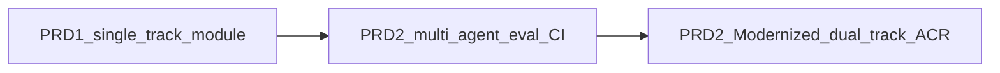

# Agentic workflow: PRD 1 → PRD 2 → PRD 2 Modernized

**Source note:** This summary is derived from [PRESEARCH.md](../PRESEARCH.md), [.cursor/rules/PRD-1-AgentForge-Clinical-Copilot.mdc](../.cursor/rules/PRD-1-AgentForge-Clinical-Copilot.mdc), [.cursor/rules/PRD-2-AgentForge-Clinical-Copilot.mdc](../.cursor/rules/PRD-2-AgentForge-Clinical-Copilot.mdc), [.cursor/rules/PRD-2-AgentForge-Agent-Roster.mdc](../.cursor/rules/PRD-2-AgentForge-Agent-Roster.mdc), [Documentation/PRD2_MODERNIZED.md](PRD2_MODERNIZED.md), and [Documentation/ARCHITECTURE_PRD2_MODERNIZED.md](ARCHITECTURE_PRD2_MODERNIZED.md). Individual chat sessions are not a source of truth for this document.

## PRD 1 (baseline)

- **Branch discipline:** Feature work on `prd_1_agentforge_monigarr` (see [PRD-1 rule](../.cursor/rules/PRD-1-AgentForge-Clinical-Copilot.mdc)); `master` stays an upstream mirror.
- **Product scope:** Clinical Co-Pilot lives primarily under [oe-module-clinical-copilot](../interface/modules/custom_modules/oe-module-clinical-copilot/); minimal upstream wiring only.
- **Agentic shape:** [PRESEARCH.md](../PRESEARCH.md) positions PRD 1 as the **orchestrator baseline** that PRD 2 extends rather than replaces; observability called out as **AgentTelemetry / Langfuse** for the copilot track.
- **Trust model (later formalized in PRD 2):** PRD 1 does not yet encode the full “extraction is untrusted until verified” program; that becomes explicit in Week 2 / PRD 2.

## PRD 2 (Clinical Co-Pilot Week 2)

- **Branch discipline:** Feature work on `prd2_agentforge`; same upstream → `master` → feature flow and module containment as [PRD-2 rule](../.cursor/rules/PRD-2-AgentForge-Clinical-Copilot.mdc).
- **Architecture:** **Constrained multi-agent layer on top of PRD 1** — supervisor routing + workers, **strict schemas**, **hybrid RAG**, with a hard rule that **extraction is untrusted** until schema validation, citation verification, and system-approved persistence ([PRESEARCH.md](../PRESEARCH.md)).
- **Runtime LLM roster:** Documented **Lead**, **Supervisor**, and **SubAgents** (File Processor, Summarizer, EHR Writer) with default models and a **verification gate** before the Lead’s user-facing answer ([PRD-2-AgentForge-Agent-Roster.mdc](../.cursor/rules/PRD-2-AgentForge-Agent-Roster.mdc)).
- **Eval / CI as workflow gate:** Golden-set eval (e.g. 50 cases), boolean rubrics, baseline/regression thresholds, PHPUnit gate tests, pre-commit hook, and workflow [.github/workflows/clinical-copilot-prd2-eval.yml](../.github/workflows/clinical-copilot-prd2-eval.yml) — agent output is expected to stay **merge-safe** under automation.
- **Orchestration vs docs drift:** [PRESEARCH.md](../PRESEARCH.md) still mentions LangChain for PRD 2; **program canon for PRD 2 Modernized** states **OpenAI tool-loop in PHP** and **LangChain/LangGraph out of program scope** (ADR-007, [ARCHITECTURE_PRD2_MODERNIZED.md](ARCHITECTURE_PRD2_MODERNIZED.md) §8) — treat that as the **updated** orchestration decision.

## PRD 2 Modernized (dual-track program)

- **Scope split:** **Track A** — Clinical Co-Pilot (PHP module); **Track B** — Next.js patient dashboard in `frontend/`, backend unchanged, FHIR/REST as contract ([PRD2_MODERNIZED.md](PRD2_MODERNIZED.md), [ARCHITECTURE_PRD2_MODERNIZED.md](ARCHITECTURE_PRD2_MODERNIZED.md) §3).
- **Agentic workflow (Track B):** **Specialized Cursor roles** (Planner, auth-implementer, fhir-client-builder, card/layout builders, deployment-verifier, Security Audit, Performance, Documentation, Verification) with **Human Lead** orchestrating outputs — explicit **AI-native** planning/implementation/review loop ([ARCHITECTURE_PRD2_MODERNIZED.md](ARCHITECTURE_PRD2_MODERNIZED.md) §7).
- **Governance:** **Agent Council Review (ACR)** and [AUDIT_PRD2_MODERNIZED.md](AUDIT_PRD2_MODERNIZED.md) as the **checklist / sign-off** surface; risks and merge discipline in [ARCHITECTURE_RISKS_PRD2_MODERNIZED.md](ARCHITECTURE_RISKS_PRD2_MODERNIZED.md).
- **Validation boundaries:** **Zod (or equivalent) on FHIR/REST JSON at the Next.js boundary**; **PHP strict validators** for copilot `lab_pdf` / `intake_form` extraction — avoids duplicating clinical extraction contracts in the frontend ([ARCHITECTURE_PRD2_MODERNIZED.md](ARCHITECTURE_PRD2_MODERNIZED.md) §3).
- **Observability:** **Langfuse in scope for both tracks when enabled** — Track A copilot traces; Track B optional **metadata-first** FHIR-proxy spans (no PHI in attributes; hashed ids per architecture) ([ARCHITECTURE_PRD2_MODERNIZED.md](ARCHITECTURE_PRD2_MODERNIZED.md) §8, §11).
- **Engineering posture:** **Documentation-as-infrastructure**, framework defense ([PATIENT_DASHBOARD_MIGRATION.md](../PATIENT_DASHBOARD_MIGRATION.md)), cost/latency and user scenarios under `Documentation/*PRD2_MODERNIZED*` — the workflow is no longer “module + eval only” but **program-wide** AI-assisted delivery with explicit audit and risk artifacts.

