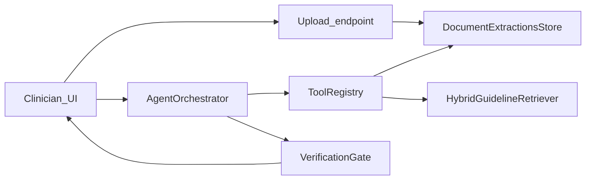

# Clinical Co-Pilot — Week 2 Architecture (PRD 2)

## Purpose

This document describes how the AgentForge Clinical Co-Pilot extension meets [PRD_2_AgentForge_Clinical_CoPilot.md](PRD_2_AgentForge_Clinical_CoPilot.md): multimodal document ingestion, hybrid guideline retrieval with reranking, parametric agent tools, citation-backed verification, and observability constraints. It extends Week 1 behavior without replacing the PRD 1 orchestrator core.

## Scope

- **Implementation root:** `interface/modules/custom_modules/oe-module-clinical-copilot/`
- **Upstream docs:** Do not treat this file as a substitute for `CONTRIBUTING.md` or repository READMEs (those remain unchanged for this track).
- **Related design notes:** `ARCHITECTURE.md`, `ARCHITECTURE_RISKS.md`, `W2_ARCHITECTURE_RISKS.md`, `AUDIT.md`, `USERS.md`
- **Cursor rules:** `.cursor/rules/PRD-2-AgentForge-Agent-Roster.mdc` (default LLM roles for runtime agents)

## High-level flow

1. Clinician uploads a **lab PDF** or **intake form** (multipart POST, same session `pid` as the chart). The server stores a **pending** temp file + `doc_type` in a session-scoped store (demo-friendly; production may move to OpenEMR `documents` + object storage).
2. The model run may call **`attach_and_extract`** with `{ "doc_type": "lab_pdf" | "intake_form" }`. Server-side code validates the pending upload, runs the **extraction pipeline** (stub or provider-backed VLM later), validates **strict shapes**, appends rows into **`document_extractions`**, and clears pending.
3. **`get_document_extractions`** (non-parametric) always returns the current extraction snapshot for citation paths under `document_extractions.*`.
4. **`retrieve_guidelines`** accepts `{ "query": "..." }`. Application code runs **hybrid retrieval**: **lexical sparse** (token + bigram overlap) plus **dense deterministic embeddings** (`DeterministicDenseEmbedder`, 128-d cosine vs query) over a small on-disk corpus, optional **Cohere rerank** when `CLINICAL_COPILOT_COHERE_API_KEY` is set, and returns **`guideline_evidence.chunks[]`** for citations. Optional manifest: `php interface/modules/custom_modules/oe-module-clinical-copilot/resources/guidelines/build_dense_manifest.php` writes `corpus_dense_manifest.json`.
5. **`VerificationGate`** resolves dot-path citations against the **merged tool bundle** (base tools + last parametric outputs from the same turn). Statements without resolvable citations are stripped.

## PRD 2 mapping

| PRD requirement | Implementation |
|-----------------|----------------|
| `attach_and_extract` + `lab_pdf` / `intake_form` | Tool `attach_and_extract` + upload endpoint; extraction pipeline interface with stub default |
| Strict schemas + citations | `ClinicalCitation`, `LabResultLine`, `IntakeFormRecord` validators; each extracted row carries citation metadata |
| Hybrid RAG + rerank | `HybridGuidelineRetriever` (sparse + dense) + `CohereReranker` (optional) |
| Supervisor + workers | Week 2 adds **parametric tools** and explicit routing via the existing OpenAI tool loop; **`AgentOrchestrator`** emits **`supervisor_handoffs`** (tool → `intake_extractor` \| `evidence_retriever` \| `chart_context`) for inspectable PRD-style handoffs. **LangGraph**-style graph wiring is **planned — not yet in tree**; it may layer on without changing verification. |
| Citation contract | Model cites `document_extractions.*` and `guideline_evidence.chunks.*`; minimum metadata shape enforced at extraction |
| No PHI in logs | Observability continues to use clipped / metadata-first payloads (`TelemetryText` patterns); do not log raw document bytes or identifiers in third-party traces |
| Eval / CI gate | **`eval/cases.json`** (50 cases) + **`eval/run_eval.php`** + **`Prd2EvalRunner`** rubrics: `schema_valid`, `citation_present`, `factually_consistent`, `safe_refusal`, `no_phi_in_logs`. **`eval/prd2_eval_baseline.json`** stores per-rubric agreement counts; each run compares current rates against **pass threshold** (default 95%) and **max regression vs baseline** (default 5 pp). **pre-commit** hook `clinical-copilot-prd2-eval` runs when this module changes. Export cases: `php .../eval/run_eval.php --export-cases`; export baseline after a clean run: `--export-baseline`. CI uploads **`--summary-json`**. **PHPUnit** `Prd2EvalGateRegressionIsolatedTest` proves the gate fails on an injected bad citation and on a non-50 case file (PRD “grader injection” expectation). |

## Write boundary

- The LLM **never** writes directly to the database.
- **`attach_and_extract`** runs **server-side** only and updates the session-backed extraction store. Optional **`CLINICAL_COPILOT_PERSIST_UPLOADS=1`**: after UI upload, a **copy** of the PDF is stored via legacy **`addNewDocument`** into the patient chart; `documents.id` is kept as **`document_extractions.provenance.chart_document_id`** for citations.
- **FHIR R4 Observation drafts**: after successful lab extraction, the tool response includes **`fhir_observation_drafts`** (JSON resources, `preliminary` / agentforge tag). These are **not** auto-posted to the FHIR server; an integrator persists or discards them after clinician validation.

## Configuration (environment / globals)

| Variable / global | Role |
|-------------------|------|
| `CLINICAL_COPILOT_OPENAI_API_KEY` / `OPENAI_API_KEY` | Chat + tool loop |
| `clinical_copilot_openai_model` (global) | Primary model id |
| `CLINICAL_COPILOT_COHERE_API_KEY` | Optional rerank |
| `CLINICAL_COPILOT_PERSIST_UPLOADS` | `1` / `true`: store upload PDF in OpenEMR Documents (`addNewDocument`); exposes `document_extractions.provenance.chart_document_id` |
| `CLINICAL_COPILOT_EXTRACTION_PIPELINE` | `stub` (default) or `gemini` (+ `CLINICAL_COPILOT_GEMINI_API_KEY`; optional `CLINICAL_COPILOT_GEMINI_MODEL`) |
| `LANGFUSE_*` | Observability (optional) |

Model routing for Lead / Supervisor / SubAgents follows `.cursor/rules/PRD-2-AgentForge-Agent-Roster.mdc`; OpenEMR currently uses a **single** OpenAI tool-loop model unless extended with additional providers.

## Risks and mitigations

- **OCR / VLM hallucination:** treat extraction as untrusted; schema + citation required; verification drops ungrounded lines.
- **Parametric tool + merge:** the orchestrator merges **base** tool outputs with **last** parametric outputs from the turn so verification matches what the model actually retrieved.
- **RAG drift:** small, versioned corpus under `resources/guidelines/`; rerank narrows candidates.

## Document control

- Version: 0.1.0 (initial W2 architecture snapshot)
- Date: 2026-05-05
- **PRD PDF parity:** Course PDF `PRD_2_AgentForge_Clinical_CoPilot.pdf` is mirrored as markdown [PRD_2_AgentForge_Clinical_CoPilot.md](PRD_2_AgentForge_Clinical_CoPilot.md) for version control and diffing; when the PDF is updated, update the `.md` in the same commit.
